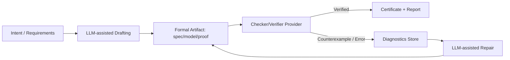

# Formal Verification with Large Language Models: State of the Art, Tooling, and a CLEF-Compatible Architecture

## Executive summary

Formal verification is the use of mathematically precise models and specifications to prove that a system satisfies required properties (or to find concrete counterexamples when it does not). In practice, formal verification spans multiple paradigms—model checking, deductive verification (verification conditions discharged by SMT/ATP), interactive theorem proving, and type-theoretic approaches—each trading off expressiveness, automation, and scalability. Seminal foundations include Hoare logic for program correctness, temporal logic for reactive/concurrent systems, and algorithmic model checking for finite-state systems. citeturn6search0turn6search5turn6search14

Over roughly 2021–2026, LLM-assisted formal verification has moved from “toy proof suggestion” to increasingly complete toolchains with (a) benchmarks and datasets, (b) retrieval-assisted premise selection and proof search, (c) repair loops driven by verifier feedback, and (d) IDE-native copilots that keep the proof assistant or verifier as the ground-truth checker. Representative research artifacts include **LeanDojo/ReProver** (Lean theorem proving with retrieval and a large benchmark extracted from mathlib), **Thor** (integrating LMs with “hammer” automation for premise selection), **Baldur** (whole-proof generation plus proof repair in Isabelle/HOL), and software-verification benchmarks like **DafnyBench** and newer prompt-and-repair systems for generating Dafny annotations. citeturn0search0turn9search0turn8search1turn8search6turn0search7

A consistent technical pattern has emerged: LLMs are most valuable when treated as **heuristic generators** (specs, lemmas, tactics, invariants, proof sketches) inside a **closed verification loop** where every candidate is checked by a trusted backend (proof assistant kernel, SMT solver, model checker). This “generate → check → repair” loop is explicitly operationalized in modern systems (e.g., whole-proof repair using error messages; annotation repair using verifier feedback). citeturn8search1turn0search7turn3search0turn4search19

However, LLMs introduce practical and scientific risks: hallucinated or irrelevant proof steps; brittle generalization across libraries/versions; ambiguous or incorrect spec synthesis; and evaluation pitfalls when “LLM-as-a-judge” is used to grade semantic correctness. Recent work has begun to benchmark these risks directly and to document dataset mismatches that can distort success rates. citeturn0search23turn8search36turn8search0

This report ends with a CLEF-aligned design: a set of **composable verification primitives** (artifacts, obligations, solver calls, certificates, traces) and orchestration patterns that integrate with LLM-driven automation while maintaining a strict soundness boundary: **only proofs/certificates verified by trusted checkers count as “verified.”** CLEF’s “independent concepts + sync-only coordination” model is particularly compatible with modular verification, contract-driven interfaces, and reproducible pipelines for automated proof/repair in CI. fileciteturn0file0 fileciteturn0file2

## Core concepts and definitions in formal verification

Formal verification starts by making two things explicit:

**Model (system semantics).** A model is a mathematically defined representation of a system’s allowed behaviors—e.g., a labeled transition system (states + transitions), an operational semantics for a programming language, or an abstract interpretation. Model checkers focus on finite (or finitized) state models and explore behavior systematically, often constructing counterexample traces when a property fails. citeturn6search14turn2search1turn2search18

**Specification (properties to satisfy).** A specification is a formal statement of intended behavior, often expressed in a logic:  
- *Safety* (“bad things never happen”), e.g., invariants;  
- *Liveness* (“good things eventually happen”), often requiring fairness assumptions;  
- Functional correctness (input/output contracts);  
- Temporal properties over executions. citeturn6search5turn6search14turn2search2

### Logics and proof systems

**Hoare logic and verification conditions.** Hoare’s axiomatic approach introduced a structured way to reason about programs using preconditions and postconditions (Hoare triples) and enabled a “proof obligations / verification conditions” view: the program plus assertions generate logical conditions whose validity implies correctness. This VC-centric decomposition underlies modern deductive verifiers and WP calculi. citeturn6search0turn3search0

**Temporal logics.** Pnueli’s work introduced temporal logic to program verification, enabling reasoning about sequencing over time and forming the basis for many temporal model-checking approaches. Linear-time (LTL) and branching-time (CTL) families are central in mainstream model checkers. citeturn6search5turn10search2turn10search3

**Model checking.** Clarke–Emerson–Sifakis model checking is algorithmic: given a model and a property formula, decide whether the model satisfies the formula, and if not, produce a counterexample. This is particularly effective for finite-state systems and has evolved into explicit-state, symbolic (BDD), and SAT/SMT-based variants. citeturn6search10turn6search14turn2search1

**Theorem proving (interactive and automated).** Interactive theorem provers (ITPs) support constructing machine-checked proofs in expressive logics (often higher-order logic or dependent type theory). Systems commonly follow the LCF tradition: a small trusted kernel checks proofs, while automation/tactics are untrusted convenience layers. Lean’s reference explicitly emphasizes a minimal kernel that checks proof terms, reducing soundness risk. citeturn5search15turn5search2turn5search1

### Type systems as verification

Type systems can enforce correctness properties by construction, from simple safety (memory/type safety) to rich dependent types. In dependently typed systems (e.g., Lean), propositions-as-types (Curry–Howard) lets proofs be represented as typed terms checked by a kernel, blurring the boundary between “program” and “proof.” citeturn5search15turn5search0turn5search4

### Refinement and contracts

**Refinement.** Refinement relates an abstract specification to a more concrete implementation via correctness-preserving steps. In reactive systems, refinement mapping is a common technique: relate low-level behaviors/states to high-level ones and show the implementation refines the spec, often with auxiliary/history/prophecy variables. Lamport’s TLA+ materials discuss refinement mappings and auxiliary variables in this style. citeturn7search20turn7search8turn10search8  
In sequential programming methodology, refinement calculus formalizes stepwise refinement as correctness-preserving transformations from abstract specs to executable programs. citeturn7search3turn7search35

**Contracts.** “Design by Contract” frames modules as having explicit obligations and guarantees (preconditions, postconditions, invariants), supporting modular reasoning and blame assignment across interfaces. This idea is widely embodied in specification languages like JML for Java and in verification-aware languages like Dafny. citeturn7search1turn7search2turn1search2

## Decomposition patterns used by verification tools

Across paradigms, scalable verification depends less on “one big proof” and more on systematic decomposition. Common patterns recur across tools such as Dafny, Why3, Frama-C/WP, Viper, and KeY:

**Modularization and interfaces.** Verification is estructured along module/procedure boundaries: each procedure is verified against its contract; callers assume the contract rather than the implementation. This reduces global reasoning and keeps proof obligations local. Viper’s methodology explicitly centers contracts (requires/ensures) and invariants as the basis for modular verification; KeY similarly generates proof obligations from JML-annotated Java and discharges them in a dynamic-logic sequent calculus. citeturn3search11turn4search16turn4search0

**Abstraction.** Tools rely on abstraction to control state explosion or logical complexity:  
- Model checking abstracts system behaviors into finite models (or uses symbolic encodings);  
- Deductive verifiers abstract complex code into logical summaries via contracts;  
- Proof assistants abstract with lemmas and structured proof hierarchies. citeturn6search14turn2search1turn10search12

**Proof obligations and verification conditions (VCs).** In deductive verification, the compiler/verifier translates annotated source into VCs—logical formulas that must be valid. Why3 is explicit about generating VCs from WhyML and using external provers to discharge them; Frama-C/WP generates proof obligations from ACSL + C using weakest preconditions; Dafny similarly integrates specification constructs into the language and uses an automated proving pipeline. citeturn1search3turn3search0turn1search2

**Pipelines with external solvers.** A canonical deductive pipeline is: parse/typecheck → generate VCs → normalize/simplify → dispatch to SMT/ATP → interpret results (models, unsat cores) back to source-level diagnostics. SMT-LIB provides a standard interchange format and scripting interface used by solvers like Z3 and cvc5; cvc5 documentation highlights explanation artifacts like unsat cores. citeturn6search11turn4search2turn4search19

**Auto-active “hinting” patterns.** Many practical verifiers are “auto-active”: the user supplies annotations/lemmas/invariants (often plus ghost code), and the tool automates the remaining proof search. Dafny documentation emphasizes methodologies and optimization techniques for making verification robust over time—essentially codifying “proof engineering” practices like abstraction and information hiding. citeturn1search10turn1search2turn3search0

**Counterexamples as first-class outputs.** Model checkers produce counterexample traces; bounded model checkers produce concrete violating executions within a bound; SAT/SMT solvers can output satisfying assignments (models) or unsat cores. These artifacts are critical for debugging *the spec* as much as debugging the code. citeturn2search18turn3search17turn4search19

## Survey of major formal verification tools and frameworks

The table below compares the major tools requested, focusing on scope, input language, approach, automation, integration, maturity, and typical use cases.

| Tool / family | Scope | Input language | Verification approach | Automation level | Integration points | Maturity & typical use cases |
|---|---|---|---|---|---|---|
| Coq / Rocq Prover | Interactive theorem proving; certified programs & math | Gallina + tactics | Dependent type theory; kernel checks proof terms | Interactive + automation via tactics | IDEs/language servers; extraction; external solvers via plugins | Mature ecosystem for high-assurance proofs and certified software |
| Isabelle/HOL | Interactive theorem proving; large libraries | Isar + tactics | Higher-order logic; LCF-style kernel; strong automation (Sledgehammer, etc.) | Interactive with powerful automation | Sledgehammer to ATP/SMT; Isabelle/jEdit | Mature for large formalizations, semantics, security, systems |
| Lean (Lean 4) | Interactive theorem proving + functional programming | Lean language + tactics | Dependent type theory; minimal kernel checking proof terms | Interactive + extensible automation | mathlib; metaprogramming; LLM copilots | Rapidly evolving; math and software verification |
| HOL4 | Interactive theorem proving | HOL logic + tactics (ML) | Higher-order logic with decision procedures and oracles | Interactive + automation | Interfaces to external engines (SMT/BDD) | Research and industrial case studies in HOL family |
| HOL Light | Interactive theorem proving | HOL logic (OCaml) | Higher-order logic; lightweight foundations | Interactive + automation | Bridges to ATP/SMT via tooling | Strong in math/hardware; compact trusted core tradition |
| Dafny | Verification-aware programming language | Dafny language | Auto-active deductive verification; contracts/invariants; typically via Boogie + SMT | High automation given good annotations | CI integration; SMT backends; Boogie | Practical verified algorithms and software components |
| Why3 | Deductive verification platform | WhyML + logic | VC generation; dispatch to multiple external provers (SMT/ITP) | Mixed: automated + interactive backends | Many provers; IDE/tooling; OCaml API | Research + practical bridge among provers |
| Frama-C (WP) | C analysis framework; deductive verification (plugin) | C + ACSL | Weakest-precondition VC generation; external provers | Auto-active; interactive when needed | Multiple analyses; SMT/ATP; proof assistants | Industrial C verification; safety/security properties |
| CBMC | Bounded model checking for C/C++ | C/C++ + assertions | Bit-precise encoding with bounded loop unwinding to SAT/SMT-like formula | Highly automated within bounds | CI; regression checks; counterexample traces | Widely used for bug finding and bounded proofs |
| SPIN | Model checking for concurrency | Promela + LTL | Explicit-state model checking; counterexamples | High automation | C codegen for specialized checker; simulation | Classic for protocols and concurrent algorithms |
| NuSMV | Symbolic model checking | SMV language + CTL/LTL | BDD-based and SAT-based (bounded) model checking | High automation | Counterexample generation; batch/interactive modes | Longstanding symbolic model checker for finite-state systems |
| TLA+ (TLC, Toolbox) | System specification/model checking | TLA+ modules (+ PlusCal) | Explicit-state model checking via TLC; engineering-focused specs | High automation for finite models | Toolbox IDE + CLI tools; VS Code extension | Widely used for distributed systems design validation |
| TLAPS | Proof checking for TLA+ | TLA+ proof language | Hierarchical proof language; backend verifiers discharge obligations | Mixed: structured proofs + backends | Toolbox integration; backend provers | Used for mechanized proofs beyond model checking |
| Alloy (Alloy Analyzer) | Lightweight modeling/analysis | Alloy language | SAT-based bounded analysis; Alloy 6 adds temporal modeling features | Fully automatic within bounds | Java API; SAT solvers; analyzer/visualizer | Popular for design exploration and counterexample-driven modeling |
| K Framework | Semantics & analysis framework | K definitions (cells + rewrite rules) | Executable rewriting semantics; supports analysis tool generation | Varies (depends on defined tools) | Language semantics + analysis tools; projects like KEVM | Used for PL semantics, VM semantics, analysis tooling |
| VeriFast | Program verification (C/Java/Rust) | Annotated code + separation logic | Symbolic execution with separation-logic specs | Semi-automated modular verification | IDE integrations; focuses on memory safety / unsafe code | Research-grade but used in teaching and case studies |
| Viper | Verification infrastructure (intermediate language) | Silver (Viper IR) | Backends: VC generation (Carbon) and symbolic execution (Silicon) | Tool-builder infrastructure | Front-end translations; SMT solvers | Used to prototype verifiers and permission logics |
| KeY | Deductive verifier for Java | Java + JML | Dynamic logic; sequent calculus; symbolic execution style | Semi-automatic + interactive | JML; proof management; case studies | Mature tool for Java verification and teaching |
| Z3 | SMT solver | SMT-LIB2; APIs | SMT decision procedures across theories | Automated (solver) | Used by many verifiers (Boogie, WP tools, etc.) | De facto standard SMT backbone |
| cvc5 | SMT solver | SMT-LIB2; APIs | Modern SMT solver; successor to CVC4 | Automated (solver) | Integration in verifiers; explanation outputs | Major open-source SMT solver used in research/industry |

Sources for tool properties in the table (official docs / primary references): Coq/Rocq documentation and repo materials citeturn1search16turn1search0turn1search32; Isabelle manuals and Sledgehammer docs citeturn5search5turn1search1turn5search1; Lean language reference and tutorials citeturn5search15turn5search4turn5search0; HOL4 and HOL Light sites citeturn5search2turn5search3; Dafny docs and compilation to Boogie citeturn1search2turn1search22turn1search6; Why3 overview citeturn1search3turn1search7; Frama-C WP manuals citeturn3search0turn3search4; CBMC references citeturn3search17turn3search1turn3search5; SPIN and Promela/LTL documentation citeturn2search0turn2search16turn10search3; NuSMV manuals citeturn2search1turn10search2turn2search29; TLA+/TLC and Toolbox repo and TLAPS site citeturn2search10turn2search2turn10search0turn10search8; Alloy docs and SAT-based analysis citeturn2search3turn10search1turn10search9; K Framework and KEVM citeturn4search1turn4search21turn4search9; VeriFast and Viper docs citeturn3search2turn3search3turn3search11; KeY project references citeturn4search0turn4search12turn4search28; SMT-LIB and solver docs citeturn6search30turn4search2turn4search39.

## Recent academic work integrating LLMs with formal verification

### Proof assistants and theorem proving

**Retrieval-augmented theorem proving at scale.** LeanDojo (NeurIPS 2023) created an open, programmatic interface to Lean proof environments and extracted a large benchmark from Lean’s math library, with fine-grained premise accessibility annotations. ReProver combines LLM generation with retrieval to select usable premises within the proof context, directly targeting the “premise selection” bottleneck in large libraries. citeturn0search0turn0search12turn0search16

**Hammer + LM hybridization.** Thor (NeurIPS 2022) explicitly decomposes theorem proving into (a) premise selection supported by hammer-style ATP/SMT calls and (b) other tasks handled by language models, reporting substantial improvements over LM-only baselines on benchmark datasets. Conceptually, Thor is an early crystallization of a general pattern: outsource search-heavy or library-heavy steps to symbolic tools, use the LM for “glue” and proposal generation. citeturn9search0turn9search7

**Proof sketches from informal reasoning.** Draft, Sketch, and Prove (DSP) uses informal proofs (human-written or LM-generated) to guide formal proof search: informal reasoning is translated into a structured sketch that decomposes the goal into subproblems, improving success rates on contest-style datasets. citeturn0search1turn0search5

**Whole-proof generation and repair.** Baldur (FSE 2023) demonstrates that LLMs fine-tuned on proofs can generate entire proofs “at once,” and that a second repair model can fix failing proofs using the error trace, improving automated proof synthesis rates and complementing Thor. This is a direct example of the generate–check–repair loop in a proof assistant setting. citeturn8search1turn8search9

### Autoformalization and translation between informal and formal math

**Natural language → formal statement translation benchmarks.** Autoformalization with LLMs (2022) showed nontrivial translation from natural-language competition problems to formal statements in Isabelle/HOL and demonstrated downstream improvements on miniF2F by training on translated theorems. citeturn9search22turn8search0  
Follow-on work created larger datasets and synthetic pipelines to scale natural-language ↔ Lean 4 statement translation, addressing the scarcity of aligned data in formal languages. citeturn0search6turn0search25

**Using proof environments to verify informal reasoning.** “Don’t Trust: Verify” (ICLR 2024) exemplifies a broader technique: use autoformalization and a theorem proving environment to validate candidate informal solutions, using the prover as an internal consistency checker rather than trusting the LM’s final answer. citeturn0search35

### Formal software verification and “annotation synthesis”

**Benchmarks for LLM-generated specifications and hints.** DafnyBench (2024) provides a large benchmark of Dafny programs and evaluates whether LLMs can generate enough annotations (pre/post/invariants/auxiliary lemmas) for the Dafny verifier to succeed. It explicitly treats verification success as an objective measure rather than subjective judging. citeturn8search6turn8search10

**Prompt-and-repair loops in verifiers.** Recent work on Dafny annotation generation explicitly uses a “repair prompt” fed by verifier errors to iteratively revise annotations until verification succeeds (or fails). This is a direct transfer of proof-repair ideas into program verification. citeturn0search7turn0search3

**Spec generation for smart-contract verifiers with feedback.** Agentic spec generators (e.g., for Move Prover workflows) use static analysis to extract relevant code context and then use verification feedback/counterexamples to refine the generated specifications, emphasizing “verifier-in-the-loop” debugging and repair. citeturn0search15

### Scaling issues: repositories, libraries, and evaluation reliability

**Repository-level verification context.** Recent work argues that scaling verification with LLMs requires handling repository-level context and premise retrieval—selecting relevant dependencies/lemmas/spec fragments under tight context windows—mirroring the key challenge identified in theorem proving. citeturn0search26turn8search3turn8search31

**Dataset mismatch and evaluation pitfalls.** Analyses of miniF2F variants show that mismatches between informal and formal statements can sharply reduce end-to-end success relative to headline component accuracies, highlighting why “pipeline evaluation” matters. citeturn8search36turn8search0  
Separately, benchmarks like RESpecBench examine the reliability of LLM-as-a-judge for specification-related evaluation, reinforcing that semantic grading is hard and that automated checking (when available) is preferable. citeturn0search23

## Practical integrations and tooling patterns in real workflows

### IDE-native “copilots” for proof assistants

A practical inflection point is IDE integration that treats the proof assistant as the verifier of record:

- **Lean Copilot** integrates LLM-driven tactic/premise suggestion inside Lean’s workflow and reports empirical benefits for interactive proving tasks relative to baseline automation (e.g., aesop). citeturn9search9turn9search6  
- **CoqPilot** operationalizes a robust pattern: generate multiple candidate proofs for a “hole,” then typecheck them using the Coq toolchain (via language-server infrastructure) and only accept a proof if it checks. This is a concrete engineering solution to hallucination: proposals are untrusted; the checker is trusted. citeturn9search3turn9search17turn9search14

### Tooling in CI/CD and developer feedback loops

In industrial-style workflows, formal methods tools already fit CI patterns because they have deterministic checkers and concrete artifacts:

- **TLA+** has both CLI tools and a Toolbox IDE, and even VS Code integration that runs TLC from the editor, enabling model checking as a repeatable build step. citeturn2search10turn2search14turn2search18  
- **Dafny** and **Frama-C/WP** naturally support “verification as a build step” (proof obligations discharged by provers); the main integration work is standardizing inputs, pinning prover versions, and storing stable diagnostics. citeturn1search2turn3search0  
- **CBMC** is explicitly designed as a bounded model checker for code and is used as an automated bug-finder/prover under bounds, generating counterexamples that can be turned into regression tests. citeturn3search17turn3search5

### Where LLMs fit best in practice

In practice, LLMs add the most value when integrated as one or more of:

- **Spec articulation assistants** (drafting contracts/invariants from intent, then verifying), aligning with design-by-contract methodologies. citeturn7search1turn1search2  
- **Proof search accelerators** (tactic prediction, premise selection, sketch generation) with immediate checker feedback. citeturn0search0turn9search0turn0search1  
- **Counterexample explainers** that translate solver/model-checker outputs into developer-understandable narratives while preserving the raw trace/model as the ground truth. (The underlying ability of tools to emit traces/models/unsat cores is what makes this feasible.) citeturn2search18turn4search19turn3search5

## Concrete ways LLMs can contribute, with pros, cons, and risks

The key to rigorous integration is to treat LLM outputs as **candidates** inside a verified pipeline, not as authoritative proofs/specs.

| Task | What the LLM produces | How it’s checked | Benefits | Main risks/limitations |
|---|---|---|---|---|
| Spec generation (contracts/invariants) | Preconditions, postconditions, loop invariants, ghost state | Run verifier; counterexamples/errors drive repair loop | Reduces annotation burden; helps novices | Ambiguous intent → wrong spec; “overfitting” to make verifier pass; can miss liveness/fairness |
| Lemma discovery | Candidate lemmas, intermediate assertions | Proof assistant/SMT checks | Breaks hard goals into solvable pieces | Library drift; irrelevant lemmas; search explosion |
| Proof sketching | Outline of proof steps / subgoals | Proof assistant checks steps or search uses sketch | Improves guidance over raw tactics | Sketch may be plausible but wrong; translation gaps |
| Tactic generation / proof steps | Next tactic(s) or proof script fragments | Typecheck / kernel check | Fast interactive assistance | Hallucinated tactics; sensitive to context/version |
| Proof repair | Patch to failing proof / annotations using error info | Re-run checker until success/failure | Converts failures into actionable iterations | Can “game” proof by weakening goals/assumptions if not constrained |
| Counterexample analysis | Explanation + hypothesized fix | Validate fix by rerun; preserve trace/model | Improves debugging velocity | Misinterpretation of trace; incorrect causal attribution |
| Translation between formalisms | TLA+ ↔ PlusCal, NL ↔ Lean/Isabelle, etc. | Parse + typecheck + downstream proof/model check | Bridges adoption barrier | Semantic mismatch; dataset bias; syntactic correctness ≠ meaning |
| User interaction / tutoring | Natural language guidance, next steps | Human review + checker feedback | Lowers expertise barrier | Over-trust; non-reproducible advice |

This matches the dominant research direction: success is achieved by anchoring to a formal checker and iterating on failure signals (proof repair in Isabelle/HOL; annotation repair in Dafny; tool-augmented premise selection in Lean/Isabelle ecosystems). citeturn8search1turn0search7turn9search0turn9search3

## CLEF-oriented composable primitives, architectures, and a roadmap

CLEF’s architecture—**independent, spec-driven “concepts” coordinated by declarative “syncs”**—is structurally aligned with modular verification and contract-driven reasoning, because it enforces explicit boundaries and discourages hidden shared state. fileciteturn0file0 fileciteturn0file1  
CLEF also already specifies a comprehensive LLM integration suite (providers, routing, prompting, agents, evaluation datasets), which can serve as the substrate for verification-oriented automation. fileciteturn0file2  
Additionally, CLEF’s process suite design emphasizes a discipline for deciding what is a true “concept” versus what is simply orchestration wiring—a useful constraint when designing verification automation as reusable primitives. fileciteturn0file3

### Verification primitives as CLEF concepts

Below is a proposed **Verification Suite** (concept inventory) designed to be broadly applicable (across theorem proving, SMT-based deductive verification, and model checking) while remaining CLEF-compatible: each concept owns its own state; all cross-concept coordination is done via syncs; strategy variation uses coordination+provider where appropriate. fileciteturn0file0

| Primitive concept | Purpose | Key state | Core actions (sketch) | Notes for LLM sync |
|---|---|---|---|---|
| VerificationArtifact | Canonical storage for specs/models/proofs and derived IRs | artifact id → content bytes, format tag, hash, provenance | create, update, get, listByHash | Enables reproducibility and caching across pipelines |
| Specification | Track formal properties and their scope | spec id → artifact refs, target scope, metadata | registerSpec, linkToArtifact, deprecate | Supports multiple formalisms (TLA+, Dafny, SMT-LIB, etc.) |
| VerificationTask | Define “what to verify” in a run | task id → target artifact(s), spec(s), toolchain config | createTask, start, cancel, getStatus | Integrates with ProcessRun-style orchestration |
| Obligation | Decompose tasks into proof obligations | obligation id → goal artifact, context refs | generate, split, markSolved/failed | Mirrors TLAPS “obligations” and VC pipelines citeturn10search12turn3search0 |
| SolverProvider (coordination) | Uniform interface over SMT/ATP/model checker/proof assistant backends | providers registry, capabilities, versions | checkSat, prove, modelCheck, typeCheck | Use coordination+provider pattern like other CLEF suites fileciteturn0file2 |
| SolverCall | Auditable record of each backend call | inputs, solver version, resource limits, outputs | run, retry, summarize | Supports deterministic replay and CI caching |
| Counterexample | Store and normalize failing traces/models/unsat cores | trace graph, model assignment, source mapping | ingest, minimize, explainRequest | Explanation uses LLM but preserves raw ground truth citeturn4search19turn2search18 |
| ProofCertificate | Store checkable proof artifacts | proof term/proof script + checker version | record, validate, diff | Enforces “only checked proofs count” |
| Translation | Controlled compilation/translation between languages | mapping rules + transform provenance | translate, validateParse, validateType | Supports autoformalization and cross-tool workflows citeturn9search22turn6search11 |
| RegressionSuite | Stability harness for proofs/specs | pinned versions, golden tasks | runAll, compare, report | Guards against library drift and nondeterminism |
| VerificationMetrics | Metrics and dashboards | success/fail, time, cost, iterations | record, aggregate, export | Feeds evaluation datasets and canary testing fileciteturn0file2 |

### Data formats and APIs

A pragmatic strategy is to treat each formalism as an opaque artifact format + a minimal set of normalized interfaces:

- **Opaque payload formats**: TLA+ modules; Lean/Coq/Isabelle files; Dafny projects; ACSL-annotated C; Promela; SMV; Alloy models; K definitions; SMT-LIB scripts. The system stores these as artifacts and relies on providers for parsing/checking. citeturn2search10turn10search7turn10search2turn10search1turn6search30  
- **Normalized result schemas**: `Verified | Counterexample(trace) | Unknown(timeout/resource) | Invalid(InputError)` plus structured attachments (unsat cores, proof objects, minimized traces). These map naturally onto CLEF’s “return variants” convention. fileciteturn0file0

For universal solver-facing interchange, **SMT-LIB v2.x** is a key standard for many pipelines (VC discharge, bounded checking encodings, etc.). citeturn6search30turn6search34

### Pipeline stages and orchestration patterns

A reference architecture that keeps soundness intact is “untrusted generation, trusted checking”:



The checker/verifier provider corresponds to TLC/TLAPS, proof assistant kernels, or VC+SMT pipelines depending on the artifact type. citeturn2search18turn10search0turn5search15turn1search3turn4search2

In CLEF terms, the orchestration can be expressed as sync chains, optionally using CLEF’s process orchestration suite when the pipeline needs explicit step lifecycle, retries, and human-in-the-loop gates. fileciteturn0file0 fileciteturn0file3

A more detailed “VC-style” variant for deductive verification:

```mermaid
flowchart TB
  S[Source + Contracts] --> P[Parse/Typecheck]
  P --> V[VC Generation / WP]
  V --> N[Normalize/Simplify]
  N --> Q[SMT/ATP Solve]
  Q -->|unsat = proved| OK[Proof Result]
  Q -->|sat = counterexample| CE[Model/Trace]
  Q -->|unknown/timeout| UNK[Unknown]
  CE --> M[Minimize / Map to Source]
  M --> R[Repair Loop (LLM + rules)]
  R --> S
```

This corresponds closely to Why3 and Frama-C/WP descriptions and to SMT-based backends like Z3/cvc5. citeturn1search3turn3search0turn4search2turn4search39

### Failure modes and safety boundaries

A CLEF-compatible verification suite should explicitly model (and measure) failure modes as first-class outcomes:

- **Soundness failures**: accepting unchecked proofs, disabling checks, or trusting LLM outputs directly (must be structurally impossible by API design).  
- **False confidence**: specs that are too weak, verification under unrealistic bounds (CBMC), or model checking of only a small finite model (TLC). citeturn3search17turn2search18  
- **Version drift**: proof breakage due to library/tool updates (proof repair datasets highlight infrastructure gaps needed to manage this). citeturn9search1turn5search5  
- **Evaluation artifacts**: reliance on LLM-as-a-judge for semantic correctness where formal checking is possible. citeturn0search23  
- **Context selection errors**: premise retrieval failures at repository scale (explicitly identified in theorem proving and repository-level verification). citeturn0search0turn8search31turn8search3

### Metrics for prototyping and evaluation

A rigorous evaluation plan should include:

- **Primary success metrics**: verification success rate (proved/verified), counterexample detection rate, and “unknown/timeout” rate under fixed budgets. citeturn3search17turn2search18turn9search0  
- **Iteration metrics**: number of LLM repair cycles to reach success; average verifier calls; prompt tokens and cost (leveraging existing LLM tracing/evaluation constructs in CLEF). fileciteturn0file2  
- **Robustness metrics**: success under tool/library perturbations; replay determinism (artifact hashes + pinned versions). citeturn0search0turn9search1  
- **Quality-of-spec metrics**: spec strength proxies (mutation resistance, property coverage, differential testing against negative examples), plus human review sampling. (When formal semantics aren’t available, these become essential complements.) citeturn0search23turn8search36

### Prioritized roadmap for prototyping in CLEF

A practical roadmap that balances feasibility with research value:

1. **Verifier-in-the-loop annotation repair (fast path to measurable wins).** Implement a Dafny-focused prototype: LLM proposes annotations; Dafny checks; failures feed a repair loop; measure on DafnyBench and on internal code. This directly matches published prompt+repair patterns and gives objective metrics. citeturn8search6turn0search7turn1search2

2. **Proof-assistant copilot integration (interactive productivity).** Integrate Lean Copilot-style flows or CoqPilot-style “hole filling + typecheck gating” into CLEF’s LLM provider + prompt/agent concepts, emphasizing strict checker gating and reproducibility. citeturn9search6turn9search3turn9search17 fileciteturn0file2

3. **Counterexample normalization and explanation.** Build Counterexample as a first-class artifact with adapters for TLC traces, CBMC traces, and SMT models/unsat cores; add LLM explanation as a non-authoritative view. Measure developer time-to-fix and correctness by rerunning checkers. citeturn2search18turn3search5turn4search19

4. **Cross-formalism translation experiments.** Start with constrained translation tasks (e.g., natural language → TLA+ skeleton; PlusCal → TLA+; informal math → Lean statement). Use parse/typecheck as minimum correctness and then evaluate downstream verification success. citeturn2search2turn2search10turn9search22turn0search6

5. **Repository-level retrieval + premise selection.** Add retrieval-backed context construction for large code/spec repositories, informed by LeanDojo and repository-level verification work; evaluate on tasks that require deep dependency resolution. citeturn0search0turn8search3turn8search31

A key engineering principle throughout is CLEF’s separation of independent concepts and sync-only coordination: verification should be composed as explicit syncable steps with auditable artifacts, not as implicit behavior inside an opaque “AI verifier.” fileciteturn0file0 fileciteturn0file3