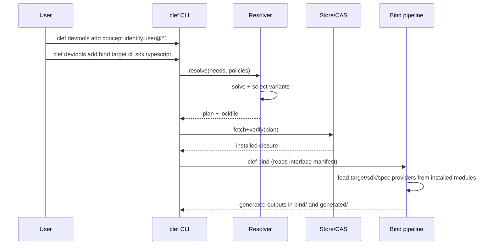

# Fine-Grained CLEF Package Model for Per-Concept Artifacts

## Executive summary

Modern package managers and plugin marketplaces converge on a shared “supply chain core”: **(a)** declarative metadata describing a unit of reuse, **(b)** a dependency graph with version/feature constraints, **(c)** an algorithm that selects a satisfiable set (often NP-complete/NP-hard in non-trivial models), **(d)** content distribution plus caching/mirroring, and **(e)** integrity and trust mechanisms that increasingly extend beyond hashes into provenance attestations and SBOMs. citeturn0search5turn3search7turn13search4turn1search0turn2search4

CLEF’s own reference materials emphasize **spec-first concepts**, **total independence** between concepts (coordination only via syncs), and a toolchain that already includes a suite/suite manifest (`suite.yaml`), scaffolding generators for multiple artifact categories, and **CLEF Bind** as a multi-target interface/SDK/spec generation system driven by an interface manifest. These documents describe a *bundle-first* packaging vocabulary (suites/suites) but do **not** specify a fine-grained, network-distributed package protocol, lockfile schema, signing/provenance policy, or repository architecture; those details are **unspecified** and must be designed.  
Local: `clef-reference.md` L7–12, L300–319, L321–334, L558–585; `naming-reference.md` L44–55, L90–127, L129–136.

A finer-grained CLEF model—resolving and downloading **per-concept artifacts** (concept specs, handlers, syncs, widgets/themes, derived concepts, UI targets, language bindings)—should treat “suite bundles” as **meta-packages** rather than the primary atomic unit. This aligns with how many ecosystems separate **interface contracts** from **implementations** (e.g., package/extension metadata vs. native binaries; plugin header vs. plugin code; OCI manifest vs. referenced blobs), and how marketplaces decompose items into plugins/themes/assets/extensions. citeturn10search8turn10search1turn11search4turn8search7turn9search6

A robust fine-grained design hinges on four primitives drawn from both practice and seminal research:

- **Contract-first modularity** (interfaces as the durable unit; implementers as replaceable modules), consistent with classic modular decomposition criteria and component-based engineering. citeturn0search4turn13search3  
- **Solver-aware dependency modeling** (capabilities/virtual provides, optional features, conflicts), acknowledging that dependency solving is NP-complete in realistic models and requires explicit policy choices (unification vs. isolation, completeness vs. performance). citeturn0search5turn3search7turn6search2turn12search1  
- **Content-addressed storage and reproducibility** (hash-addressed blobs, lockfiles, transactional installs/rollbacks), exemplified by Merkle-DAG artifact graphs and purely functional stores. citeturn9search38turn1search2turn1search1turn8search0  
- **End-to-end trust** (repository metadata frameworks like TUF, build provenance like SLSA, pipeline attestations like in-toto, plus SBOMs in SPDX/CycloneDX). citeturn0search6turn13search2turn1search0turn2search3turn2search4turn1search3

This report proposes: an artifact taxonomy; a module manifest schema; a dependency model with host/build/runtime edges and capability-based constraints; composition operators (merge/override/patch) that unify suite-level composition with per-artifact overrides; a staged/transactional installer; and an integration plan for CLEF Bind + CLI using a “devtools manifest” and lockfile, including runnable-looking examples and mermaid diagrams.

## Ecosystem survey of package managers and registries

Across ecosystems, implementation details differ, but the “shape” is consistent: a **manifest** describes dependencies and metadata; a **registry/index** provides discovery and versions; a **resolver** computes a plan; a **downloader** fetches artifacts; a **verifier** checks integrity and increasingly provenance; an **installer** materializes files (often with post-install hooks), and a **cache** accelerates repeats.

Language ecosystems provide crisp examples:

- npm: dependency and package metadata in `package.json`, exact resolution in `package-lock.json` including `resolved` and `integrity` (SRI hashes), and first-class provenance support via Sigstore-backed publish attestations. citeturn3search0turn3search1turn3search2  
- pip/Python: standardized repository API (PEP 503 / PyPA Simple Repository API), a backtracking resolver, and “hash-checking mode” (`--require-hashes`) for repeatable installs; caching is explicit (`pip cache`). citeturn4search1turn3search3turn4search0turn14search4  
- Maven: a POM (`pom.xml`) as the fundamental unit, with “nearest definition wins” dependency mediation (deterministic conflict rule); Maven repos can publish checksums and (often required) PGP signatures, especially for Central. citeturn5search28turn5search0turn15search4turn15search8turn15search19  
- Cargo: a registry index rooted by `config.json`, plus feature flags (`[features]`) for optionality; invariants around immutability of published crate versions are reinforced by checksums in index/lock behavior. citeturn5search1turn12search1turn5search1turn5search1  
- Composer: `composer.json` describes dependencies; `composer.lock` fixes exact versions; security tooling increasingly includes `composer audit`. citeturn5search2turn15search3  

System-level distribution managers emphasize mirrors, repository metadata, and trust roots:

- APT-style repositories: `Release`/`InRelease` (inline-signed) metadata, checksums that bind index files and packages into a chain of trust, and features like `Acquire-By-Hash` to reduce race conditions and hash mismatch errors in mirrored environments. citeturn7search0turn7search6turn6search1turn6search25  
- Homebrew: formula metadata plus “bottles” (binary packages); official docs describe cache locations and configuring caching proxies for bottles and the JSON API. citeturn14search3turn5search7  
- Chocolatey: packages are defined via a `.nuspec` (NuGet-style metadata) including dependencies; the community repository adds moderation and validation rules, including scrutiny of install scripts and malicious behaviors. citeturn6search3turn6search7turn6search30  

Sandboxed desktop packaging shows stronger atomicity patterns:

- Flatpak: an OSTree-backed repository model; docs explain architecture and repository summary metadata, and community guidance stresses signing commit/summary metadata for secure mirrored distribution. citeturn8search0turn8search4turn8search20  
- Snap: signed “assertions” are policy/identity statements used by snapd and the store to validate and govern processes. citeturn8search1turn8search17  

Universal artifact distribution is increasingly centered on OCI registries:

- OCI Distribution Spec standardizes an API for distributing content; OCI image/manifest graphs are based on descriptors (digest + size + media type) and explicitly modeled as Merkle DAGs; referrers/subject links enable attaching SBOMs, signatures, and other supply chain artifacts to a primary artifact. citeturn8search7turn9search38turn9search6turn9search34  

Repository-level signing and provenance is in flux: Docker Content Trust (Notary v1/TUF-based) is being retired for official images, reflecting an ecosystem shift toward newer signing/verification tooling and artifact-graph approaches. citeturn9search1turn9search17  

### Comparative table of package managers and registries

| Ecosystem | Primary unit | Manifest / metadata schema | Resolver approach | Integrity / provenance | Registry/mirrors & caching |
|---|---|---|---|---|---|
| npm | package tarball | `package.json`; lock includes `resolved` + `integrity` | deterministic tree build + semver ranges; lock for exactness | lockfile integrity (SRI); registry provenance attestations via Sigstore | local cache; registry-based; lock stores resolved locations citeturn3search1turn3search2turn14search1 |
| pip | wheel / sdist | PEP 503 / Simple API; requirement specifiers (PEP 508) | backtracking resolver | `--require-hashes` hash-checking; reporting; caching | explicit cache mgmt (`pip cache`); simple repo mirrors support citeturn3search3turn4search0turn4search1turn14search4 |
| Maven | artifact (jar/pom) | `pom.xml`; repo layout + metadata | “nearest definition wins” mediation | Central requires checksums; PGP signatures common/required | repo managers proxy & mirror; checksums and signatures carried citeturn5search0turn15search4turn15search8turn15search19 |
| Cargo | crate archive | `Cargo.toml`; registry index with `config.json`; feature flags | solver with features/optional dependencies | checksum immutability assumptions; lock pins | registry index (git/sparse); local registry caches citeturn5search1turn12search1turn14search18 |
| apt | .deb | control fields + repository metadata (`InRelease`) | solver over package relationships | apt-secure chain-of-trust via signed metadata; `Acquire-By-Hash` | extensive mirror ecosystem; by-hash mitigates race errors citeturn7search0turn7search6turn6search25 |
| Flatpak | app/runtime commits | OSTree refs + summary metadata | runtime dependency model + refs | signed commits/summary (common best practice) | mirrors viable due to signed metadata; repo summary for listing citeturn8search0turn8search20turn8search4 |
| Snap | snap package | assertions (signed policy/identity docs) | store-mediated dependency/runtime model | assertions as signed trust objects | store + brand stores; policy distribution via assertions citeturn8search1turn8search17 |
| OCI registries | digest-addressed blobs/manifests | distribution spec + descriptors; referrers | selection outside spec (client policy) | digest-addressed integrity; referrers attach SBOM/signatures | registries/proxies; “graph of artifacts” patterns via referrers citeturn8search7turn9search38turn9search6turn9search2 |
| VS Code marketplace | extension (.vsix) | `package.json` manifest (contributions, activation events) | marketplace selection + version install | marketplace signs extensions; install-time verification | extension mgmt via UI/CLI; per-version install options citeturn11search1turn11search14turn11search4 |
| WordPress plugin directory | plugin zip | plugin header metadata; directory guidelines | WordPress-controlled activation | repository governance/review guidelines | updates via WP admin; plugin headers drive metadata citeturn10search8turn10search0 |
| Drupal modules | module/theme | `.info.yml` metadata + dependencies; Composer integration | Drupal + Composer-based dependency mgmt | ecosystem moving toward stronger signing (still evolving) | packages.drupal.org generates metadata for Composer; caches matter citeturn10search1turn10search21turn10search5 |

## Marketplace decomposition patterns for plugins, themes, assets, and extensions

Plugin and asset marketplaces typically decompose “modular items” along two axes:

1. **Host integration surface** (what the host can load/activate: plugin, module, extension, theme, package).  
2. **Granularity and compatibility metadata** (host version constraints, dependencies, activation events, UI contributions).

Several ecosystems illuminate design choices relevant to per-concept CLEF artifacts:

WordPress models a plugin as a directory/zip where the main file contains a structured header (at minimum, “Plugin Name”), and repository participation is governed by explicit guidelines and review norms. This is a strong precedent for **“manifest embedded within the artifact”** and “directory listing derives from the artifact,” rather than a separate external manifest. citeturn10search8turn10search0

Drupal formalizes metadata in a `.info.yml` file for modules/themes/install profiles, including control over activation/deactivation and compatibility. Drupal also integrates with Composer and generates static metadata translations for Composer consumption (packages.drupal.org), highlighting a hybrid: **ecosystem-native metadata** plus **translated metadata for a general dependency manager**. citeturn10search1turn10search21turn10search5

Unity’s Package Manager uses a `package.json` manifest similar in format (but not semantics) to npm’s, supports “scoped registries” to map name scopes to registry URLs, and uses lockfiles to ensure consistent resolution. This strongly parallels what CLEF Bind already does conceptually: artifact selection based on target + registry scope could map cleanly onto concept/handler/widget namespaces. citeturn10search3turn10search7turn11search6

VS Code extensions use a `package.json` manifest specifying contribution points and activation events; critically, the marketplace signs extensions and clients verify signatures at install time. This provides a direct model for **store-signed artifacts** and **install-time trust checks**, which can be layered with publisher attestations. citeturn11search4turn11search0turn11search14

Envato Market’s WordPress integration emphasizes OAuth/personal tokens and an API-driven update/install pathway. Even though Envato is more “commerce” than “dependency graph,” it illustrates a per-item identity model where an “item” can be independently installed and updated, and authorization is central. citeturn10search2turn10search6

From these, a key decomposition insight for CLEF is:

- **Concept specs** behave like *host-recognized contracts* (Drupal `.info.yml`, VS Code manifest, npm `package.json`)—small, stable, metadata-heavy.  
- **Handlers, UI widgets, and Bind targets/SDK providers** behave like *pluggable implementations and assets*—larger, variant-heavy (by language/target/platform), and often needing build steps. citeturn11search4turn10search7turn12search1turn3search2

## Academic foundations and modern supply-chain security concepts

### Modularity and component-based engineering

CLEF’s “total independence” principle aligns with classic modularity criteria: modules should be chosen such that change impact is localized and interfaces are explicit. This directly echoes privacy/data-hiding-driven decomposition. citeturn0search4  
Local: `clef-reference.md` L7–12.

Component-based software engineering extends this with “independent deployability + composability under a component model,” a framing useful for **handler implementations** and **UI targets** as separately deployable components bound to a concept contract. citeturn13search3

### Dependency solving theory and practical algorithms

Dependency resolution complexity is not academic trivia: realistic ecosystems with version ranges, conflicts, and optionality hit NP-complete/NP-hard behavior, which is why real package managers rely on specialized solvers, backtracking, and policy heuristics. citeturn0search5turn3search7turn3search3turn0search29

For CLEF, moving from suite-level bundles to per-concept artifacts increases the solver search space (many more nodes and variant dimensions), so the model must include **explicit resolution policies** and likely **lockfiles as first-class outputs** rather than optional artifacts.

### Versioning, reproducibility, and content-addressability

Semantic Versioning defines a contract between version numbers and compatibility expectations; but ecosystems vary in how strictly they adhere and what range operators mean. CLEF should adopt SemVer-style compatibility for concept contracts where feasible, but must explicitly define what counts as an “API break” in a concept spec. citeturn12search0turn12search10turn4search6

Reproducible builds formalize the goal “same sources + environment + instructions ⇒ bit-identical outputs,” which is directly relevant for handler builds, generated SDKs, and derived concepts. citeturn1search1turn1search5

Content-addressable storage (CAS) and Merkle-DAG artifact graphs appear in multiple mature systems: purely functional stores in Nix-like models and descriptor/digest–addressed blobs in OCI. These provide stability, deduplication, and make transactional installs easier. citeturn1search2turn9search38turn8search7

### Provenance, signing, and SBOMs

Software update security research identified broad classes of package manager attacks and drove designs like TUF to survive key compromise via role separation, delegation, and threshold signing. citeturn13search4turn13search2turn0search6

In-toto generalizes this toward end-to-end supply chain transparency: “what steps were performed, by whom, and in what order,” captured as verifiable metadata. citeturn0search7turn2search18turn2search3

SLSA specifies levels/tracks and standardized “build provenance” attestation concepts. citeturn1search4turn1search0turn1search8

SBOM standards like SPDX and CycloneDX provide machine-readable component inventories and relationships, increasingly incorporating provenance/pedigree and higher-level artifacts. citeturn2search4turn2search1turn2search6turn1search3

Practically, some ecosystems now ship provenance attestations at publish time: npm provenance is generated by the registry and logged in transparency systems, signaling where CLEF could go for per-concept publication. citeturn3search2turn3search14

## Proposed fine-grained CLEF package model

CLEF’s local references already enumerate multiple artifact categories (concept specs, sync specs, handler implementations, interface manifests, and more) and encode a “coordination + provider” pattern where a coordination concept dispatches to provider implementations (e.g., interface targets/SDKs/spec providers). A fine-grained package model should treat each dispatchable “provider” as a separately versioned module.  
Local: `clef-reference.md` L321–334, L300–317, L604–614.

### Primitives and artifact taxonomy

Define “CLEF modules” as **versioned, independently retrievable units** containing one primary artifact (plus metadata, signatures, and optional auxiliary files). Suggested module kinds:

- **Concept module**: one `.concept` contract spec (primary), plus optional documentation/examples.  
- **Sync module**: one `.sync` spec (primary), depending on specific concept contract versions.  
- **Handler module**: a language-specific implementation of one concept contract (primary code), possibly with build instructions and platform selectors.  
- **Widget module**: one `.widget` UI component spec/implementation.  
- **Theme module**: one `.theme` package.  
- **Bind target module**: a provider implementation for a Bind target (REST/GraphQL/gRPC/CLI/MCP/etc.).  
- **SDK provider module**: a provider implementation for a language SDK generator (TypeScript/Python/Go/Rust/Java/Swift/etc.).  
- **Spec provider module**: OpenAPI/AsyncAPI generation providers.  
- **Suite (meta) module**: corresponds to `suite.yaml`/suite semantics, but ideally becomes a *thin composition layer* referencing other modules rather than containing them.

This is consistent with existing naming conventions and “one concept per file / one sync per file,” which naturally supports per-file package identities.  
Local: `naming-reference.md` L44–55, L129–133; `clef-reference.md` L718–721.

### Module identity, naming, and registries

A workable identity pattern must support:

- stable IDs (human-meaningful)
- namespace ownership (publisher/org)
- multi-artifact linkage (handler implements concept X)
- variant selection (language, platform, target)

A pragmatic scheme:

- `clef:<namespace>/<name>` as a logical ID (URI-friendly, matches the existing notion of concept URIs in the ConceptManifest IR).  
Local: `clef-reference.md` L254, L718.

For example (illustrative, exact syntax **unspecified** in the current docs):

- Concept: `clef:repertoire/identity.user`  
- Handler: `clef:repertoire/identity.user#handler.ts`  
- Sync: `clef:repertoire/registration-flow#sync`  
- Bind target provider: `clef:bind/target.cli`  

Registry model options (not mutually exclusive):

1. **OCI-based registry** for all binary/source artifacts and attached supply-chain artifacts (SBOM, signatures, provenance), leveraging digest-addressed blobs and referrers graphs. citeturn8search7turn9search38turn9search6turn9search34  
2. **Lightweight “simple index”** for fast metadata lookups in the style of PEP 503, where the canonical unit is a versioned file list and metadata can be fetched cheaply. citeturn4search1turn4search5  
3. **Git-backed registry index** like Cargo’s index, enabling mirroring and offline-friendly updates (good for massive numbers of small modules). citeturn5search1turn14search2  

Given the expected explosion of per-concept/per-handler modules, a hybrid is often best: **index for resolution; blob store for content**.

### Dependency graph model

CLEF’s “total independence” suggests: **concept modules should not depend on other concept modules** for state/actions; instead, **sync modules** and **derived modules** express coordination.  
Local: `clef-reference.md` L7–12, L560–561.

Recommended dependency edge types (modeled explicitly; do not overload one “depends” field):

- `requires.contract`: hard dependency on a concept contract (version range).  
- `requires.provider`: dependency on a provider kind (e.g., “needs a storage adapter,” “needs an interface target provider”).  
- `provides.capability`: virtual capability offers (similar to Debian `Provides` for virtual packages). citeturn7search7turn6search2  
- `conflicts`: incompatibility constraints (package cannot co-install/activate). citeturn6search2turn7search7  
- `optional`: optional dependency edges that are included only if a feature/selector is enabled (analogous to Cargo features). citeturn12search1turn12search9  
- `build_requires`: dependencies needed only to build an artifact (compilers, generators, etc.), separate from runtime requirements.

Distinguish what “environment” an edge is relevant to:

- `host` (developer machine / build host)
- `build` (tooling to produce artifacts)
- `runtime` (deployment environment)
- `bind` (interface generation phase)

This mirrors how ecosystems separate run/build/test deps and helps avoid over-installation.

### Composition operators and override semantics

CLEF already has suite-level composition primitives: suites include concepts/syncs, have tiers, and can `uses` other suites optionally.  
Local: `clef-reference.md` L558–585, L587–591.

To generalize to per-concept modules while preserving suite composition ergonomics, define a small set of composition operators that apply uniformly to suites, devtools manifests, and interface manifests:

- **Merge (structural union)**: combine maps/sets; for lists, append then dedupe by identity; used for adding features, adding syncs, adding providers.  
- **Override (replacement)**: replace a field/subtree; used for “choose this implementation” or “replace registry URL.”  
- **Patch (targeted edit)**: JSON Patch / YAML patch-style operations against a resolved manifest, used for fine-grained tweaks.  
- **Mask/disable**: explicitly disable a module or sync tier entry (mirrors “recommended can be disabled”).  
Local: `clef-reference.md` L587–591.

Cargo’s `[patch]` concept provides a concrete precedent for “override this dependency with another copy/source,” which is a common need for monorepos and emergency hotfixes. citeturn12search21

### Resolution policies and conflict strategies

Because dependency solving is hard and policy-heavy, the package model must declare conflict-handling strategy:

- **Unification (single version per module ID)**: simplest and matches most language managers’ defaults; yields a consistent “one concept contract version per project” story.  
- **Isolation (side-by-side versions)**: more complex but sometimes necessary, especially for tooling modules or UI assets; Nix-like stores make side-by-side versions practical. citeturn1search2turn1search38  
- **SAT/backtracking**: completeness-oriented solving for complex constraints and optional features; pip’s backtracking narrative is a practical “user-facing” model for explaining resolver behavior. citeturn3search3turn3search7turn0search5  

Capabilities/feature-driven resolution should be first-class:

- If a sync requires “any provider that provides capability `storage:kv`,” the resolver selects a provider module that `provides.capability` (Debian-style). citeturn7search7  
- If the user specifies “enable feature `oauth`,” optional edges are activated (Cargo-style). citeturn12search1  

### Installation lifecycle: staged and transactional

A per-concept model increases the chance of partial installs and inconsistent states unless install is staged. Use a **two-phase** approach:

1. **Stage**: download all required blobs into a content-addressed store; verify integrity + signatures; build/compile in isolated build directories; generate outputs.  
2. **Activate**: atomically switch a “current generation” pointer to the new closure, then materialize/relink into `generated/` and `bind/` (both already treated as disposable).  

This mirrors benefits in purely functional deployment models and commit-addressed distribution systems. citeturn1search2turn8search0turn9search38  
Local: `naming-reference.md` L133–136 (generated/bind disposable).

### Provenance and signing policy

A credible baseline policy for CLEF modules should combine:

- **Repository metadata security**: adopt TUF for repository metadata (roles, delegations, thresholds) to reduce single-key compromise impact and improve survivability. citeturn0search6turn13search2  
- **Build provenance**: attach SLSA provenance attestations (or SLSA-compatible) to built artifacts, stating where/when/how produced. citeturn1search0turn1search8turn1search36  
- **Pipeline transparency**: support in-toto layouts/links for critical modules (especially compiler/generator modules), enabling “farm-to-table” verification. citeturn2search18turn0search7turn2search3  
- **SBOMs**: emit SPDX and/or CycloneDX for each module and/or each assembled closure; support both to satisfy different consumers. citeturn2search4turn2search1turn2search6turn1search3  
- **OCI attachment graph** (if OCI is used): store SBOM/signature/provenance as referrers to the primary artifact digest. citeturn9search6turn9search34turn9search26  

## CLEF manifests, CLI workflows, and Bind integration

CLEF Bind is already described as a multi-target generator system driven by an interface manifest and provider routing concepts, with explicit target/spec/SDK provider categories. A fine-grained package model should make these provider categories resolvable modules.  
Local: `clef-reference.md` L300–317, L314–317.

### Proposed module manifest schema

Each module should carry a machine-readable manifest (embedded inside the artifact, like WordPress and VS Code do, or as an OCI “config” blob with annotations).

The current CLEF docs mention a language-neutral **ConceptManifest** IR with fields like `uri`, `name`, type parameters, JSON schemas, and capabilities. That gives a strong anchor for what belongs in contract modules.  
Local: `clef-reference.md` L714–724.

A proposed `clef.module.yaml` (name **unspecified**) schema:

| Field | Type | Meaning |
|---|---|---|
| `apiVersion` | string | Schema version for the module manifest (e.g., `clef.dev/v1`) |
| `kind` | enum | `concept`, `sync`, `handler`, `widget`, `theme`, `bind-target`, `sdk-provider`, `spec-provider`, `suite` |
| `id` | string (URI) | Globally unique module ID (URI form recommended) |
| `version` | semver | Module version; SemVer rules apply (documented) citeturn12search0 |
| `publisher` | object | Publisher identity + contact + signing keys (TUF delegated role target) citeturn0search6 |
| `description` | string | Human description |
| `license` | string | SPDX license expression (if applicable); used in SBOM generation citeturn2search4 |
| `artifacts[]` | list | Files/blobs with `mediaType`, `digest`, `size`, `path`, `platformSelectors` (host/os/arch/lang/target) |
| `provides.capabilities[]` | list | Capability labels provided (virtual provides) citeturn7search7 |
| `requires[]` | list | Typed dependencies with scope: `contract`, `provider`, `build`, `host`, `runtime`, `bind` |
| `conflicts[]` | list | Conflicting module IDs/capabilities |
| `features` | map | Optional feature flags (Cargo-like) enabling optional deps citeturn12search1 |
| `entrypoints` | map | For plugins/providers: how the runtime loads it (module class, binary, command) |
| `build` | object | Build recipe references (toolchain, commands, inputs) and expected outputs; link to provenance |
| `provenance` | list | Pointers/digests for SLSA provenance + in-toto metadata citeturn1search0turn2search18 |
| `sbom` | list | Pointers/digests for SPDX/CycloneDX citeturn2search4turn2search6 |
| `signatures` | list | Signature material / references (TUF targets metadata, cosign-style, etc.) citeturn0search6turn9search26 |

Unspecified: exact file naming, whether YAML vs JSON, and where this manifest lives in the artifact are not defined in current CLEF docs.

### Proposed project devtools manifest schema

CLEF’s naming reference defines `clef.yaml` as project config but does not define a “devtools manifest”; therefore, the existence and filename are **unspecified** and introduced here as a proposal.  
Local: `naming-reference.md` L55–56.

A candidate `devtools.yaml` (or a `devtools:` section inside `clef.yaml`) should express “needs” at a higher level than modules:

| Field | Type | Meaning |
|---|---|---|
| `project` | object | Project identity, default namespaces |
| `registries[]` | list | Registry endpoints + trust roots (TUF root keys) + mirrors + auth policy citeturn0search6turn7search0 |
| `needs.concepts[]` | list | Concept contract IDs + version ranges |
| `needs.syncs[]` | list | Sync IDs + optionality/tier preference |
| `needs.handlers[]` | list | Desired handler languages/platforms; provider selection constraints |
| `needs.ui[]` | list | Widgets/themes + UI targets |
| `needs.bind` | object | Targets (REST/GraphQL/gRPC/CLI/MCP/…) + SDK languages + spec formats (OpenAPI/AsyncAPI) |
| `features` | map | Feature toggles that activate optional deps (Cargo-like) citeturn12search1 |
| `resolutionPolicy` | object | Unification vs isolation; upgrade policy; conflict policy; solver timeouts citeturn0search5turn3search3 |
| `overrides` | list | Patches/overrides/resolutions (Cargo `[patch]` analogue) citeturn12search21 |
| `lockfile` | string | Lockfile path (generated) |
| `security` | object | Required signatures, provenance level, SBOM format(s), allowed publishers |

### Resolver behavior: “needs → plan → lock”

Mermaid flow for dependency resolution:

```mermaid
flowchart TD
  A[devtools manifest: needs] --> B[Fetch module metadata/index]
  B --> C[Expand needs into constraint graph]
  C --> D[Select variants by selectors\n(lang/target/os/arch)]
  D --> E{Solve constraints}
  E -->|SAT/backtracking| F[Resolution set]
  E -->|unsat| G[Explain conflict\n(minimal unsat core if possible)]
  F --> H[Compute closure\n(build/host/runtime/bind scopes)]
  H --> I[Write lockfile\n(ids, versions, digests, sources)]
```

Hardness note: NP-completeness/NP-hardness is common in realistic models; user-facing explanations and lockfiles mitigate the complexity burden. citeturn0search5turn3search7turn3search3

### Installer lifecycle: staged/transactional

Mermaid flow for install lifecycle:

```mermaid
flowchart TD
  A[Lockfile] --> B[Download all blobs to CAS store]
  B --> C[Verify digests + signatures]
  C --> D[Verify provenance + SBOM policy]
  D --> E[Stage build steps\n(handlers, derived concepts, SDKs)]
  E --> F[Assemble new generation\n(closure)]
  F --> G[Atomic activate\n(update current pointer)]
  G --> H[Materialize to workspace\nconcepts/ handlers/ generated/ bind/]
  H --> I[Post-install checks\nconformance/tests optional]
```

CAS + “generation switching” is consistent with purely functional deployment ideas and commit-addressed repos; signed-metadata repos (Flatpak/OSTree) demonstrate why staging + verification enables safe mirroring. citeturn1search2turn8search20turn9search38

### Bind/CLI integration behavior

CLEF Bind’s provider routing implies a runtime behavior: at bind time, it should load target/spec/sdk provider modules that match the interface manifest and installed provider set.  
Local: `clef-reference.md` L300–317, L604–614.

Mermaid sequence tying CLI → resolver → Bind:



### Concrete examples

#### Example devtools manifest snippet

```yaml
# devtools.yaml (proposed; filename currently unspecified)
registries:
  - name: primary
    type: oci
    url: oci://registry.example.com/clef
    tufRootKeys: ["..."]   # required for TUF-based metadata (proposed)

needs:
  concepts:
    - id: clef:repertoire/identity.user
      version: "^1.2.0"
    - id: clef:repertoire/auth.password
      version: "^2.0.0"

  handlers:
    - concept: clef:repertoire/identity.user
      language: ts
      preference: ["clef:repertoire/identity.user#handler.ts"]
    - concept: clef:repertoire/auth.password
      language: rust
      optional: true

  syncs:
    - id: clef:repertoire/registration-flow
      tier: required

  bind:
    targets: ["cli", "rest"]
    sdks: ["typescript"]
    specs: ["openapi"]

resolutionPolicy:
  mode: unify          # one version per module id (default)
  conflicts: fail      # or "explain-and-suggest"
  optionalStrategy: prefer-off
  solverTimeoutMs: 20000

security:
  requireSignatures: true
  requireSlsaProvenance: "build-level-2"
  sbomFormats: ["spdx", "cyclonedx"]
```

This reflects existing CLEF artifact categories (concepts, syncs, handlers, interface generation targets) but makes them resolvable per item.  
Local: `clef-reference.md` L321–334, L300–317; `naming-reference.md` L90–127.

#### Example lockfile excerpt

```yaml
# devtools.lock.yaml (proposed)
resolvedAt: "2026-03-03T18:22:10Z"
modules:
  - id: clef:repertoire/identity.user
    version: "1.2.3"
    digest: "sha256:..."
    source: "oci://registry.example.com/clef/repertoire/identity.user@1.2.3"
    sbom:
      spdx: "sha256:..."
      cyclonedx: "sha256:..."
    provenance:
      slsa: "sha256:..."
  - id: clef:repertoire/identity.user#handler.ts
    version: "1.2.3+ts.5"
    digest: "sha256:..."
    selectors:
      language: "ts"
```

Digest-addressed outputs align with OCI descriptor semantics and CAS stores, and enable attaching SBOM/provenance as referrers. citeturn9search38turn9search6turn1search0

#### Example CLI transcript

```bash
$ clef devtools init
$ clef devtools add concept clef:repertoire/identity.user@^1.2
$ clef devtools add sync clef:repertoire/registration-flow@^0.4 --tier required
$ clef devtools add handler clef:repertoire/identity.user --lang ts
$ clef devtools add bind --target cli --spec openapi --sdk typescript

$ clef resolve
# -> writes devtools.lock.yaml

$ clef install
# -> fetches, verifies, stages, activates; populates concepts/, handlers/, generated/, bind/

$ clef bind
# -> generates bind/cli, bind/rest, bind/sdk-ts, etc.
```

`generated/` and `bind/` being disposable is already a documented convention, which makes staged regeneration a natural fit.  
Local: `naming-reference.md` L133–136.

## Tradeoffs of per-concept vs suite-level packaging

Per-concept packaging is not “free”; it moves complexity into the resolver and user experience. The key tradeoffs:

Per-concept advantages:

- **Better caching and reuse**: small artifacts (concept specs, small syncs) are reused across suites; content-addressability amplifies benefits. citeturn9search38turn1search2  
- **Provenance granularity**: you can sign/attest each handler implementation and generator separately, and attach SBOMs per module. citeturn1search0turn2search4turn0search7  
- **Composable provider ecosystems**: Bind targets/SDKs become swappable modules, matching CLEF’s coordination/provider pattern in the reference docs.  
Local: `clef-reference.md` L604–614, L300–317.  
- **Finer upgrade control**: upgrade a handler without upgrading a suite; upgrade a widget without touching concept contracts.

Per-concept costs:

- **Resolution complexity**: more nodes, more variants, more optionality; practical consequence is solver time/conflict likelihood. citeturn0search5turn3search7turn3search3  
- **UX surface area**: users might prefer “install suite X” rather than selecting 15 concepts and 20 handlers. (Mitigation: keep suites as meta-modules and expose curated recipes.)  
- **Atomicity semantics**: suite-level bundles provide a “known-good” integrated set; per-concept requires stronger lockfile discipline and transactional install to preserve stability. citeturn3search1turn1search2turn1search1  
- **Namespace/version governance**: concept contract compatibility rules must be clear, or SemVer becomes unreliable; ecosystems routinely struggle with “SemVer in name but not in practice.” citeturn12search0turn12search10turn4search6  

A balanced recommendation is:

- Keep **suites** as curated *meta packages* (thin `suite.yaml` referencing module IDs and tiers), preserving “easy onboarding.”  
- Move production distribution toward **per-concept/per-provider modules**, with a default devtools workflow that starts from a suite and then allows subtracting/replacing modules via overrides and patches.  
Local: `clef-reference.md` L558–585, L587–591.

## Key design decisions to finalize for CLEF

The current CLEF documents provide strong internal structure (concept/sync/suite manifests, Bind providers, caching directories) but leave several critical packaging details **unspecified**. To ship a fine-grained model, CLEF needs explicit choices on:

- Registry architecture: OCI-only vs hybrid (index + blob store) vs git-index; mirror policy and offline behavior. citeturn8search7turn5search1turn4search1  
- Trust model: adopt TUF roles/delegations and key workflow; decide whether the store signs artifacts, publishers sign artifacts, or both (VS Code store-signing + npm publisher attestation is a relevant dual model). citeturn0search6turn11search14turn3search2  
- Provenance policy: minimum SLSA level, in-toto requirements for “core” modules (compiler/generator), and whether SBOMs are mandatory in SPDX, CycloneDX, or both. citeturn1search4turn2search3turn2search4turn2search6  
- Resolution policy defaults: unify vs isolate; whether “capability provides” are allowed and how selection is constrained; conflict explanation UX. citeturn7search7turn0search5turn3search3  
- Manifest and lockfile schemas: canonical format, versioning, and compatibility guarantees (lockfile stability matters). citeturn3search1turn5search2turn11search6  

Finally, the design should reflect CLEF’s core modularity constraint: **concept contracts remain independent**, and composition/coordination is expressed via syncs and provider routing. That constraint is not just philosophical; it simplifies dependency semantics for concept specs and pushes the graph complexity into syncs, handlers, and interface targets—precisely where fine-grained packaging yields the most wins.  
Local: `clef-reference.md` L7–12, L560–561, L604–614.

### Referenced entities and historical anchors

This report’s modularity foundation builds on work by **entity["people","David L. Parnas","software design researcher"]** on modular decomposition. citeturn0search4  
Supply-chain security draws on work by **entity["people","Justin Cappos","tuf researcher"]** and collaborators on package manager attacks and compromise-resilient update frameworks. citeturn13search4turn13search2  
Purely functional store ideas draw on work by **entity["people","Eelco Dolstra","nix researcher"]**. citeturn1search2  
Dependency solving theory and practice is represented by research from **entity["people","Roberto Di Cosmo","software package mgmt researcher"]**, **entity["people","Stefano Zacchiroli","software package mgmt researcher"]**, and **entity["people","Pietro Abate","dependency solving researcher"]**. citeturn0search5turn0search13  
in-toto’s supply chain guarantees are associated with **entity["people","Santiago Torres-Arias","in-toto researcher"]** and collaborators. citeturn0search7turn2search3  
Standards and ecosystem anchors include **entity["organization","Open Container Initiative","container standards body"]**, **entity["organization","Linux Foundation","technology nonprofit"]**, and **entity["organization","OWASP Foundation","security nonprofit"]**. citeturn8search7turn1search24turn2search14  
Ecosystem examples include **entity["organization","Debian","linux distro project"]**, **entity["organization","Apache Software Foundation","open-source foundation"]**, **entity["company","GitHub","code hosting company"]**, **entity["company","Docker","container software company"]**, **entity["company","Microsoft","technology company"]**, **entity["company","Canonical","ubuntu company"]**, **entity["company","Unity Technologies","game engine company"]**, and **entity["company","Envato","digital asset marketplace company"]**. citeturn7search0turn5search28turn9search4turn9search1turn11search1turn8search1turn10search7turn10search6