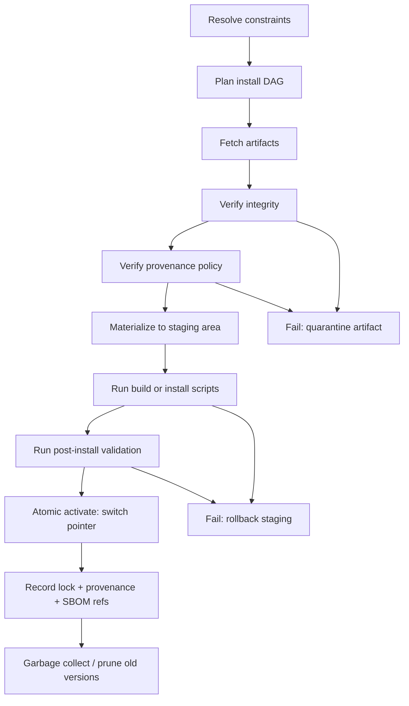
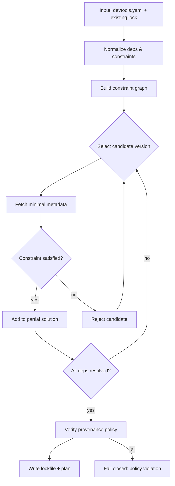

# Package Managers, Artifact Repositories, and Modular Component Stores

## Executive summary

Package managers and marketplaces are all solutions to the same core problem: **how to name, locate, trust, compose, and lifecycle-manage modular artifacts** across time and environments. Their observable differences come from three design choices: (a) **what the “module” is** (source library vs OS package vs sandboxed app bundle vs plugin), (b) **where composition occurs** (build-time linking, install-time file placement, or runtime discovery/loading), and (c) **what the trust boundary is** (central registry, signed metadata, signed artifacts, content-addressed objects, or end-to-end provenance attestations). citeturn11search0turn11search19turn5search10turn4search11turn6search31

Across mainstream ecosystems (npm, pip, Maven, Cargo, Composer; apt/Homebrew/Chocolatey; Flatpak/Snap; Git/GitHub Packages/OCI registries), a convergent architecture emerges:

1) **Resolvers** interpret a manifest’s dependency constraints and produce a concrete, usually lockfile-backed, dependency graph (sometimes with backtracking/SAT-like techniques). citeturn8search0turn1search0turn0search2turn11search0turn10search1  
2) **Registries** separate *metadata index* from *artifact bytes* (often CDN-backed), enabling caching/mirroring and partial downloads. citeturn12search17turn8search7turn2search7turn14search0turn3search0  
3) **Integrity and authenticity** have shifted from “TLS-only” toward layered defenses: signed repository metadata (apt, Snap assertions, Flatpak/OSTree), content-addressable digests (OCI), consumer-side hash pinning (pip), and provenance attestations (npm provenance; SLSA/in-toto patterns). citeturn14search0turn2search1turn13search22turn7search7turn0search1turn6search31turn6search4turn4search11  

Marketplaces for plugins/themes/assets (WordPress, Drupal, Envato Market, Unity Asset Store, VS Code extensions) reveal an additional decomposition axis: items are often **runtime-loaded extensions or content assets**, where “dependency” is frequently a **platform/version compatibility constraint** rather than a formal transitive graph—and the “installation” is frequently a **content placement + activation step** rather than a linkable build artifact. citeturn3search5turn3search2turn10search0turn13search7turn10search2turn9search5  

For CLEF, the most transferable primitives are:

- **Module identity** (stable naming + publisher + type + version) and **module representation** (manifest schema)  
- **Dependency graph production** (constraints → resolved DAG/graph + lock) and **policy layers** (overrides, patches, allow/deny)  
- **Composition operators** (merge, override, patch) with explicit conflict rules  
- **Staged, transactional install** (fetch→verify→materialize→activate) with rollback  
- **Provenance and attestations** (signatures, SBOMs, build provenance, transparency logs)  
- **Lifecycle commands** (add/update/remove/audit/verify) and runtime behaviors (load order, compatibility gating)

These map naturally onto Clef’s “spec-first independent concepts + sync-based coordination” model and its suite bundling and interface generation. fileciteturn0file0 fileciteturn0file1  

## Survey of package managers and artifact registries

This section focuses on **architecture, metadata schemas, dependency resolution, versioning, distribution mechanics, signing/provenance, registries/mirrors/caches, and security** across the requested systems.

### Common reference architecture

Most ecosystems can be described in four planes:

**Plane A — Authoring & metadata:** a manifest (package.json, pyproject.toml, pom.xml, Cargo.toml, composer.json, formula, control fields) declares identity, dependencies, compatibility, and sometimes build hooks. citeturn0search0turn7search4turn0search10turn1search28turn1search5turn1search10turn7search10  

**Plane B — Constraint solving & locking:** a resolver selects versions satisfying constraint languages (SemVer-like ranges, PEP 440 specifiers, Maven mediation rules, SAT/backtracking). Lockfiles record the concrete solution for reproducibility. citeturn8search0turn11search0turn0search2turn10search25turn1search0turn1search1turn10search1  

**Plane C — Distribution & storage:** registries typically serve (1) a metadata index and (2) artifact blobs; storage is frequently content-addressed by digest or checksum, enabling caching and dedup. citeturn12search17turn2search7turn2search31turn2search8turn5search12  

**Plane D — Trust & policy:** verification can attach at multiple points: TLS transport, signed repository metadata, artifact signatures, pinned hashes, and end-to-end attestations (build provenance, SBOM, transparency logs). citeturn14search0turn14search16turn6search31turn0search1turn14search3turn6search2turn6search3  

### Language ecosystems: npm, pip, Maven, Cargo, Composer

**npm (package manager + registry model):**  
The core manifest is `package.json`, which defines package identity and dependencies (including separate dependency classes such as dev and peer metadata). citeturn0search0 Dependency locking is typically done via `package-lock.json`, which records the exact dependency tree to enable repeatable installs. citeturn10search25 A major contemporary security addition is **npm provenance**: when publishing with provenance enabled, the registry produces signed provenance statements backed by Sigstore infrastructure and logged to a public transparency ledger. citeturn6search31turn6search34  
Security posture (high-level) therefore combines: registry identity + transport protections, lockfile-based integrity pins, and optional provenance attestations—though the ecosystem remains exposed to a wide range of non-cryptographic supply-chain attacks (typosquatting, dependency confusion, maintainer takeovers), well-documented in both classic and modern research. citeturn11search19turn11search27  

**pip / PyPI (Python packaging):**  
Python’s packaging ecosystem is explicitly standardized via PEPs and the Python Packaging User Guide specifications. Project metadata is increasingly expressed in `pyproject.toml` (§PEP 621; plus the formal `pyproject.toml` spec) while dependency expressions use the PEP 508 grammar and versions use PEP 440. citeturn7search0turn7search4turn0search13turn7search16 Distribution formats include wheels (PEP 427; also captured in the “binary distribution format” spec). citeturn8search1turn8search5  
pip’s modern resolver explicitly uses **backtracking** to recover from earlier assumptions during constraint satisfaction. citeturn8search0 For integrity, pip supports “hash-checking mode” via `--require-hashes`, requiring pinned versions and hashes for all dependencies, and it documents how caching interacts with hash-checking. citeturn0search1turn0search9 On the repository interface side, the “Simple Repository API” (PEP 503) defines a minimal standardized index format; more featureful JSON endpoints exist but are not necessarily treated as a standardized API in the same way as PEP 503. citeturn8search3turn8search7turn8search15turn7search13  
In short: Python has unusually explicit standards for metadata and repository access, plus consumer-side hash pinning, but still contends with complex dependency resolution behaviors and metadata quality issues typical of large open ecosystems. citeturn8search0turn7search21turn11search0  

**Maven (Java) and Maven Central-style repositories:**  
Maven’s unit of metadata is the POM (`pom.xml`). It models project identity and relationships including transitive dependencies. citeturn0search18turn0search10 Maven conflict handling is historically characterized by **dependency mediation** (notably “nearest definition wins,” with tie-breaking rules). citeturn0search2  
On distribution integrity: publishing to Central-class repositories typically requires checksum files and PGP signatures for artifacts; this requirement is explicitly documented by Sonatype Central and also referenced by Maven guidance. citeturn12search4turn12search0turn12search16 This creates a chain where consumers can verify artifacts independently even when artifacts are fetched from mirrors/CDNs, provided they trust and verify the signature material and metadata. citeturn12search8turn11search19  

**Cargo / crates.io (Rust):**  
Cargo formalizes manifest structure via `Cargo.toml` and documents dependency specification and resolution as first-class concerns. citeturn1search28turn1search8turn1search0 Resolution output is stored in `Cargo.lock`, which “locks” dependency versions; Cargo documents this in its resolver reference. citeturn1search0 Cargo’s registry architecture includes a Git-based index with a `config.json` root that tells Cargo how to access the registry, illustrating a sharp metadata/data separation and distributable index design. citeturn12search17  
Integrity in practice often includes **checksums recorded for registry packages** (and used for verification against cached crate tarballs), reflecting the general pattern “lockfile includes integrity material.” While ecosystem discussion exists in many places, the key architectural takeaway for CLEF is that Cargo treats the registry index as a verifiable metadata structure that can be mirrored and cached separately from large artifact blobs. citeturn12search17turn12search25  

**Composer / Packagist (PHP):**  
Composer’s fundamental flow resolves `composer.json`, writes concrete selections to `composer.lock`, and encourages committing the lockfile for deterministic installs. citeturn1search1turn1search5 Packagist is the default repository discovery layer for Composer packages. citeturn1search29 In Drupal’s ecosystem specifically, Drupal.org provides its own Composer metadata repository (`packages.drupal.org`) because Drupal projects are not listed on Packagist by default. citeturn3search6  
Security and integrity in Composer ecosystems are partly mediated by lockfiles and repository metadata, but the ecosystem also inherits the general open-registry threat model described in supply-chain security literature. citeturn11search19turn11search27  

### OS and developer workstation package managers: apt, Homebrew, Chocolatey

**apt (Debian-family):**  
apt’s trust model is squarely focused on a *signed repository metadata chain*. Debian’s “secure apt” model is built around cryptographic validation of downloads; apt-secure documents the chain-of-trust that begins with maintainer signing and continues through repository signing and client verification. citeturn14search0turn14search1 Repository format docs describe the role of `InRelease` (inline-signed) and/or `Release` + `Release.gpg` (detached signature) as metadata that cryptographically binds indexes and package hashes. citeturn0search15turn14search17 Debian Policy documents the dependency/conflict fields (Depends, Pre-Depends, Conflicts, Breaks, Provides, Replaces, etc.), emphasizing that OS-level package management includes explicit negative constraints and rich relationship semantics. citeturn7search2turn7search6  
This is exactly the class of ecosystem where academic results about NP-completeness of dependency solving and the need for specialized solving strategies were first studied in depth. citeturn11search0turn11search21turn11search31  

**Homebrew:**  
Homebrew describes packages as **formulae** (Ruby-based package definitions) and distributes precompiled binaries as **bottles** (tarballs) with metadata encoded in filename and formula DSL. citeturn1search10turn1search2 It supports **taps** as external sources of package definitions, illustrating a federated registry model built atop Git hosting and local trust decisions. citeturn1search34 Homebrew historically relies heavily on checksums for fetched artifacts (and community review norms); modern supply-chain efforts increasingly propose stronger provenance and code-signing flows at tap/bottle time, aligning it with ecosystem-wide moves toward attestations. citeturn6search1turn1search18  

**Chocolatey:**  
Chocolatey packages are `.nupkg` (NuGet-derived) archives with a `.nuspec` manifest describing metadata (including dependencies) and scripts that perform installation/uninstallation. citeturn1search11turn1search35 The Chocolatey community repository is explicitly moderated with human review for new versions, and it also uses automated verification/validation services, demonstrating a governance-centric security approach in addition to technical controls. citeturn1search3turn1search19turn1search23 This makes Chocolatey a strong example of a “store-like” model: security is partially a *process* (review + policy enforcement), not only cryptography. citeturn11search19  

### Sandboxed app distribution: Flatpak and Snap

**Flatpak (OSTree-backed):**  
Flatpak uses OSTree repositories to distribute and deploy data; installed apps and runtimes are OSTree checkouts. citeturn2search0 Under-the-hood documentation describes each application/runtime/extension as a branch in a repository and highlights efficient updates, rollbacks, and deduplication—properties directly tied to content-addressed, Git-like storage semantics. citeturn2search8 Build inputs are specified via Flatpak “manifests” consumed by flatpak-builder, which describe build parameters and modules. citeturn2search4  
On trust, OSTree supports signing commits and repository summary metadata; practical guidance emphasizes that signatures allow secure use of HTTP and mirrored repos, because integrity is verified independently of transport. citeturn13search22turn13search14  

**Snap:**  
Snap documentation describes **assertions** as digitally signed documents used by snapd/the store to handle authentication, identification, and validation, reflecting a first-class signed-metadata architecture. citeturn2search1turn2search13 Snap’s security model is also strongly coupled to sandboxing/confinement policies, making “module installation” inseparable from runtime confinement decisions. citeturn2search17turn2search33  

### Version control and universal artifact registries: Git submodules, GitHub Packages, Docker/OCI registries

**Git submodules (universal downloader by commit pinning):**  
Submodules embed a repository inside another repository, allowing a superproject to pin a dependency to a specific commit while preserving separate history. citeturn2search2turn2search6 This is “dependency resolution” in its simplest form: selection is the pinned commit ID, and update is an explicit action. For CLEF, submodules are an instructive baseline for “module = commit snapshot” with no solver—high integrity (commit-addressed) but low automation and poor UX for transitive dependency graphs. citeturn2search30  

**GitHub Packages (multi-registry hosting):**  
GitHub Packages provides registries for several ecosystems and explicitly distinguishes container/OCI-optimized storage in its Container Registry. citeturn3search0turn3search8 This illustrates a “unified host, multiple protocol front-ends” approach—useful for CLEF if CLEF wants one canonical host that can serve suite metadata, release tarballs, and OCI-style artifacts under a single identity and permission model. citeturn3search4turn3search32  

**Docker registries / OCI distribution (universal artifact transport):**  
The OCI Distribution Specification standardizes the API for distributing content like container images. citeturn2search7turn2search15 The registry protocol is explicitly digest-oriented: clients verify content against manifest-specified digests after download, making “content-addressed integrity” a core design rather than an add-on. citeturn2search31turn2search7  
For signing and provenance, the ecosystem is shifting away from Docker Content Trust/Notary v1 and toward newer signing mechanisms; Docker itself has documented DCT deprecation, while ecosystems increasingly emphasize modern signing solutions (e.g., Notary Project/Notation; Sigstore Cosign). citeturn7search15turn14search2turn14search3turn14search12  

## Plugin and asset marketplaces as module ecosystems

Marketplaces introduce additional constraints absent in library package managers: *UI-driven discovery*, license enforcement, platform compatibility, and runtime enable/disable semantics. The decomposition of “module” is therefore often closer to “feature extension” and “content bundle” than “linked dependency.”

### WordPress plugins: metadata in code headers and readme-driven storefront

WordPress plugin identity and metadata are partially encoded in a required header comment in the main plugin PHP file, which WordPress uses to recognize and describe the plugin. citeturn3search5 Presentation in the WordPress.org plugin directory is heavily driven by a standardized `readme.txt` format. citeturn3search1 The plugin directory’s governance goals explicitly frame the directory as a “safe place” for users, reflecting the store-like security model where policy/review and ecosystem norms are core controls. citeturn10search3turn10search19  

Key decomposition properties:

- **Plugin**: runtime-loaded code extension + configuration surface; install means “place code + activate,” updates mean “replace code + migration hooks.” citeturn3search5  
- **Theme**: presentation-layer module (templates + assets), often with its own compatibility constraints. (Theme specifics are not fully specified in the provided sources; treated as unspecified here.)  
- **Dependencies**: historically weakly expressed as formal graphs in core UX; compatibility is often implicit (WordPress version, PHP version, plugin conflicts). (Formal dependency semantics for WP plugins are unspecified in the cited docs; treated as unspecified.) citeturn11search19  

### Drupal modules/themes/distributions: explicit metadata + Composer integration

Drupal requires a `.info.yml` file to store metadata about a module/theme/profile in Drupal 8+ (and beyond). citeturn3search2 Modern Drupal workflows strongly integrate with Composer for dependency management, and Drupal.org provides Composer metadata for Drupal projects via `packages.drupal.org`. citeturn3search14turn3search6  
Drupal distributions further illustrate a “meta-package” model: a distribution’s packaging system assembles an archive containing Drupal core plus referenced contrib modules/themes/libraries. citeturn9search34turn9search3  

Decomposition properties:

- **Module**: functional extension; Drupal core discovers and loads it using `.info.yml` metadata. citeturn3search2  
- **Theme**: presentation extension; also uses `.info.yml`. citeturn3search2  
- **Distribution**: curated composition; packaging assembles a complete installable set, closer to an application bundle than a library. citeturn9search34turn9search22  
- **Dependency semantics**: partly handled at the Drupal metadata layer and increasingly via Composer (SemVer-ish constraints and lockfile), pulling Drupal closer to “language package manager” behavior. citeturn3search14turn1search1  

### Envato Market: items as licensed theme/plugin products with token-mediated updates

Envato provides a formal Market API (OAuth-driven) and a token-authorization model for accessing purchased items. citeturn9search2turn10search6turn10search18 For WordPress customers, Envato distributes an “Envato Market” plugin that uses an API personal token to install and update purchased themes/plugins. citeturn10search2turn10search10 Envato also documents licensing constraints for marketplace-distributed WordPress/Drupal themes/plugins (GPL compatibility requirements for GPL platforms). citeturn9search5  

Decomposition properties:

- **Item**: a commercial artifact with license terms, not just code; identity includes purchase entitlements (token). citeturn10search2turn9search5  
- **ThemeForest theme / CodeCanyon plugin**: platform-specific package types; update mechanism is typically mediated via marketplace tooling rather than platform-native registries. citeturn9search9turn10search2  
- **Composition**: primarily “install into platform,” not transitive dependency solving in the package-manager sense; dependencies are often informal (e.g., “requires plugin X”). (Formal dependency schema is unspecified in the cited Envato docs; treated as unspecified.) citeturn11search19  

### Unity Asset Store and Unity Package Manager: assets vs packages as distinct module kinds

Unity’s ecosystem is explicitly dual-format:

- **UPM packages** managed by Unity Package Manager (manifested via `package.json`), with project-level `manifest.json` specifying dependencies and `packages-lock.json` capturing deterministic resolution results. citeturn10search0turn9search16turn10search1  
- **Asset Store items**, which can include UPM packages installable through the editor’s “My Assets” context; Unity documents “install a UPM package from the Asset Store.” citeturn9search4  

Unity also supports **scoped registries**, allowing multiple package registries to coexist and be configured through the project manifest. citeturn9search0turn9search16  

Decomposition properties:

- **Asset**: content bundle (models/textures/audio/tutorial projects) or editor extension; install often means importing files into a project. citeturn9search4  
- **UPM Package**: structured, versioned, dependency-managed module (closer to npm semantics). citeturn10search0turn10search1  
- **Registry model**: close to npm: package manifest is “similar to npm’s package.json format but uses different semantics,” and can point to custom registries. citeturn10search0turn9search16  

### VS Code extensions: signed marketplace distribution + manifest-driven capabilities

VS Code extensions require a `package.json` manifest (extension manifest) with VS Code–specific fields like activation events and contributions. citeturn3search3turn3search27 Publishing is mediated by marketplace publisher identity and token-based credentials. citeturn3search11turn13search23  
Crucially, Microsoft’s marketplace signs extensions on publication, and VS Code verifies signatures at install time to check integrity and source. citeturn13search7turn13search19turn13search30  

Decomposition properties:

- **Extension**: runtime-loaded module; composition is a capability merge (“contributes”) and activation model (“activationEvents”), plus implicit conflicts (keybinding collisions, overlapping contributions). citeturn3search27turn3search3  
- **Distribution trust**: store signing + client verification is first-class. citeturn13search7turn13search19  

## Academic and standards foundations for modularity, dependency management, and supply-chain integrity

### Modularity and component-based software engineering

The modern “module” notion is rooted in classic modularity principles: **decomposition criteria matter** and “information hiding” can yield systems that are more flexible and comprehensible. citeturn4search1turn4search5 This aligns with component-based software engineering notions where software is assembled from reusable components with well-defined interfaces, rather than rewritten per application. citeturn4search10turn4search6  

Two transferable lessons for CLEF:

- A “module” must have a **stable interface contract** and explicit assumptions; the more implicit the assumptions, the more fragile composition becomes. citeturn4search1turn11search24  
- Governance and packaging infrastructure must support **independent evolution**: separate releases, explicit versioning policy, and compatibility signaling. citeturn4search0turn5search1  

### Package management theory: dependency solving as (often) NP-complete

Research in free/open-source package distributions shows that non-trivial dependency solving—especially with conflicts and multiple versions—is computationally hard in the worst case and has been shown NP-complete in realistic package constraint languages. citeturn11search0turn11search31turn11search21 As a result, ecosystems either:

- adopt **heuristics/mediation rules** (e.g., Maven “nearest wins”) to avoid full-blown solving complexity, citeturn0search2  
- implement **backtracking** (pip) or other search-based solving, citeturn8search0  
- or leverage SAT/PBO/MILP-style solvers in some distribution contexts (documented in dependency-solving literature and tooling history). citeturn11search31turn11search8turn11search5  

This literature also frames dependency solving as a separable concern: a front-end can translate constraints into a solver-friendly format and outsource solving to specialized engines—a pattern relevant to CLEF because CLEF can separate “semantic module intent” from “resolution machinery.” citeturn11search8turn11search0  

### Semantic versioning as a social contract layer

Semantic Versioning 2.0.0 is a widely used convention that encodes compatibility claims into MAJOR.MINOR.PATCH changes and supports pre-release/build metadata. citeturn4search0 In practice, many ecosystems implement SemVer-like constraints but diverge in details (PEP 440 differs from SemVer, Maven uses mediation and can use ranges, etc.), so CLEF should treat SemVer as a **useful default policy** rather than a universally reliable truth. citeturn4search0turn7search16turn0search2  

### Reproducible builds and content-addressable storage

A build is reproducible if, given the same source, environment, and instructions, any party can recreate bit-for-bit identical artifacts. citeturn5search1turn5search17 Reproducibility underpins independently verifiable supply chains, and it also enables aggressive caching (content-addressable build outputs). citeturn5search13turn5search12  
Content-addressable storage (CAS) shows up repeatedly:

- **Nix** uses cryptographic hashes to compute unique paths for component instances and highlights atomic upgrades/downgrades and concurrent versions. citeturn5search12turn5search4  
- **Flatpak/OSTree** uses Git-like models (branches, commit deltas, dedup) and supports rollbacks. citeturn2search8turn13search22  
- **OCI registries** use digests to verify layers/manifests. citeturn2search31turn2search7  

For CLEF, CAS implies a direct path to “download once, reuse everywhere,” plus strong integrity-by-design.

### Provenance, attestations, and secure update frameworks

Classic package-manager security analysis demonstrates that many package managers are vulnerable to MITM and repository compromise under weak trust models, motivating stronger update frameworks and key management. citeturn11search19turn5search10 **The Update Framework (TUF)** provides compromise-resilient metadata roles and threshold signing; its specification and original CCS paper emphasize survivable key compromise and separating “secure retrieval of updates” from “installation policy.” citeturn5search6turn5search10  
**in-toto** generalizes end-to-end supply chain integrity by collecting cryptographically verifiable evidence about steps, actors, and ordering (“farm-to-table guarantees”). citeturn4search11turn4search7  
**SLSA** (current v1.2 docs) defines levels/tracks and recommends provenance attestation formats, focusing on making “what built this artifact, how, and from what inputs” verifiable. citeturn6search4turn6search30turn6search27  

Finally, SBOM standards such as SPDX and CycloneDX provide interoperable representations of component inventories, dependencies, and provenance/pedigree information—making them practical interchange formats for “module composition transparency.” citeturn6search6turn6search2turn6search3turn6search11  

## Composable primitives for modular downloading, composition, and lifecycle management

This section proposes a set of **general-purpose primitives** (concepts + operations + data structures) that unify the behaviors of package managers, artifact repositories, and plugin marketplaces.

### Core primitives

**Module**  
A named, versioned, typed unit of reuse. A module can represent: library code, OS package, sandboxed app, plugin/extension, asset bundle, or “suite” composition. The module abstraction exists independently of how it’s packaged. citeturn4search1turn11search0  

**Artifact**  
A concrete, immutable byte object (tarball, wheel, jar, `.deb`, VSIX, OCI layer) addressed by a digest (preferred) and optionally by human tags (version strings). Artifact immutability is a major simplifying assumption for caching and integrity. citeturn2search31turn5search12turn10search1turn8search5  

**Manifest**  
A structured, machine-readable declaration describing module identity, dependencies, compatibility, and (optionally) build/install hooks. Examples: npm `package.json`, Python `pyproject.toml`, Cargo `Cargo.toml`, Unity `package.json`, Drupal `.info.yml`, VS Code extension `package.json`. citeturn0search0turn7search4turn1search28turn10search0turn3search2turn3search3  

**Resolver**  
A constraint solver that transforms a set of dependency requirements into a concrete set of chosen versions and sources. Resolvers vary from heuristic rules to backtracking to SAT-based solving. citeturn8search0turn0search2turn11search31turn11search0  

**Lock**  
A persistent record of a resolution result describing “exactly what was installed/built,” typically including versions, sources, and integrity materials. Examples: npm `package-lock.json`, Cargo.lock, Unity `packages-lock.json`, Composer `composer.lock`. citeturn10search25turn1search0turn10search1turn1search1  

**Store / Registry / Remote**  
A system that serves module metadata and artifacts, often separated into index and blob store (or allowing mirrors). Examples: PEP 503 simple indices, Cargo registry index, OCI registries, Debian repositories. citeturn8search3turn12search17turn2search7turn0search15turn14search17  

**Cache**  
A local or shared content-addressable store of artifacts and/or materialized install outputs. Caching becomes reliable when artifacts are immutable and addressed by digest or pinned hashes. citeturn5search12turn0search1turn2search8turn2search31  

### Dependency graph model

A general dependency graph should support:

- **Positive edges**: “requires” with version constraints and selectors (platform markers, features, optionality) citeturn0search13turn1search0turn7search2  
- **Negative edges**: “conflicts/breaks” and “provides/replaces” style relationships for OS-like ecosystems citeturn7search2turn7search6  
- **Variant edges**: build-time vs runtime vs dev/test dependencies; peer/host/tool dependencies citeturn0search0turn10search1turn7search4  
- **Source edges**: where to fetch from (registry, git URL, local path) citeturn9search16turn9search28turn8search3turn2search30  
- **Integrity edges**: digest, checksum, or signature references linking metadata to bytes and provenance citeturn6search31turn2search31turn0search1turn14search3  

### Composition operators: merge, override, patch

Many ecosystems silently conflate *resolution* with *composition*. For CLEF (and for a general modular downloader), it is useful to treat composition as explicit operators applied to module graphs and module contents.

**Merge (structural union)**  
Combine two module sets or configuration layers, preserving both when non-conflicting. Equivalent analogies: merging lockfiles (rarely safe), overlaying dependency roots, or composing two plugin sets.

**Override (precedence rule)**  
Prefer one module version/source/setting over another. Examples in practice: Maven dependency management can force a version; Unity project manifest overrides registry; apt pinning; npm overrides/resolutions (ecosystem-dependent; conceptually common). citeturn0search2turn9search16turn14search0turn11search0  

**Patch (transform)**  
Apply a transformation to module content or metadata: source patch sets, build-script modifications, or policy injection. This resembles both (a) code patching and (b) metadata rewriting (e.g., adding constraints or fixing broken metadata). Drupal distribution packaging (assemble + place) is effectively a patch/transform pipeline over upstream modules. citeturn9search3turn9search34  

To make composition safe, each operator should specify:

- scope: metadata graph vs file content vs generated output  
- ordering: deterministic precedence rules  
- conflict behavior: fail, warn, or auto-resolve  
- audit footprint: recorded in provenance (see below)

### Installation model: staged and transactional

A robust general install lifecycle can be expressed as a staged state machine with rollback points. This borrows from Nix’s atomic upgrades and from OSTree-style commit switching. citeturn5search4turn2search8turn13search22  

Mermaid: generic staged install lifecycle (transactional)



Key design commitments:

- **Staging directory**: never mutate the “active” environment until validation passes.  
- **Atomic activation**: switch a pointer (symlink, ref, database pointer) rather than rewriting in-place. citeturn5search4turn2search8  
- **Rollback semantics**: keep prior activated state until explicitly GC’d. citeturn2search8turn5search4  

### Conflict resolution strategies

Because dependency solving is hard and conflicts are common, a general system should support multiple strategies, selected by policy:

1) **Isolation / multiple versions side-by-side**: Nix-style hashed store paths, Flatpak runtimes, container images. citeturn5search12turn2search8turn2search7  
2) **Single-version unification with mediation**: Maven “nearest wins,” npm-style flattening/duplication tradeoffs. citeturn0search2turn11search33  
3) **SAT/backtracking with constraint explanation**: pip backtracking; solver-assisted minimal conflict sets from academic work. citeturn8search0turn11search0turn11search8  
4) **Capability gating**: plugin marketplaces often choose compatibility gating (engine version, platform version) instead of transitive dependency composition. citeturn13search7turn3search2turn10search0  

### Provenance, signing, and audit primitives

A general system should represent “trust” as explicit, composable policies rather than implicit assumptions.

**Integrity** (bytes unchanged) can be enforced via:

- pinned hashes (pip `--require-hashes`) citeturn0search1  
- content-addressed digests (OCI) citeturn2search31turn2search7  
- signed repository metadata (apt, OSTree, Snap assertions) citeturn14search0turn13search22turn2search1  

**Authenticity** (publisher identity) can be enforced via:

- PGP artifact signatures (Maven Central style) citeturn12search0turn12search4  
- store signing (VS Code marketplace signing) citeturn13search7turn13search19  
- Sigstore keyless signing (npm provenance; Cosign; PyPI direction) citeturn6search31turn14search12turn6search5turn6search21  

**Provenance** (how it was built) can be expressed via:

- SLSA provenance attestations and level policies citeturn6search4turn6search30  
- in-toto links/layout evidence about steps and actors citeturn4search11turn4search7  

**Transparency** (tamper-evident logs) appears in Sigstore-backed provenance flows. citeturn6search31turn6search34  

**SBOM** (component inventory) can be recorded in SPDX/CycloneDX, tying “what is in this module” to both compliance and security scanning. citeturn6search6turn6search3turn6search2  

## Mapping to CLEF: manifest fields, CLI workflows, and Bind integration

This section maps the above primitives into CLEF’s architecture and naming conventions, including proposals for a “devtools manifest,” CLI commands/workflows, Bind behaviors, and end-to-end examples.

### CLEF baseline assumptions from the provided references

From the CLEF reference:

- Clef’s core building units are independent **concepts** (spec-driven services with their own state/actions) wired by declarative **syncs**; concepts never reference other concepts’ state/types/actions. fileciteturn0file0  
- Clef bundles related artifacts as suites (with `suite.yaml` describing concepts, sync tiers, and `uses` dependencies), including optional provider concepts. fileciteturn0file0  
- Clef has **Bind**, which generates programmatic interfaces including CLI from interface manifests, and a CLI with commands including `kit`, `interface`, `bind`, and more. fileciteturn0file0 fileciteturn0file1  
- Project structure and naming conventions include: `clef.yaml`, `suite.yaml`, `.interface.yaml`, `.deploy.yaml`, with generated outputs in `generated/` and interfaces in `bind/`, both disposable. fileciteturn0file1  

The provided references do not explicitly define a “devtools manifest” file or its schema; that detail is therefore **unspecified** in the supplied CLEF materials and is proposed below as a new/extended manifest. fileciteturn0file1  

### Proposed CLEF module primitives

In CLEF terms, the natural “module” units are:

- **Suite module**: a distributable bundle containing `suite.yaml` + `.concept` specs + `.sync` specs (and optionally `.derived`, `.widget`, `.theme`, code templates, reference handlers, etc.). The exact allowed contents are **unspecified** in the provided CLEF references; proposal: allow a declared set and validate it. fileciteturn0file0  
- **Provider module**: optional implementations for coordination concepts (provider pattern), consistent with the “coordination + provider” architecture described in suites. fileciteturn0file0  
- **Interface target module**: Bind target providers (REST/GraphQL/CLI/MCP/SDK) are already conceptualized as providers; distribution of third-party Bind targets fits this module model. fileciteturn0file0  

### Proposed “devtools manifest” for CLEF

Design goals:

- describe suite dependencies and sources (registries/git/local)  
- support composition operators (override/patch) at the suite level  
- produce a lockfile with integrity and provenance references  
- become the single input to deterministic “fetch → verify → materialize” runs  
- integrate into `clef generate`, `clef bind`, and `clef build` flows without violating concept independence

#### Manifest file naming

Because Clef already uses `clef.yaml` as project config, a compatible naming could be:

- `devtools.yaml` (as the user requested), or  
- `clef.devtools.yaml` (to avoid collisions), or  
- embed under `clef.yaml` as a `devtools:` section.

The canonical name is **unspecified**; below uses `devtools.yaml`.

#### Proposed schema fields

The table below is a proposed schema for CLEF’s devtools manifest. It is intentionally aligned to the cross-ecosystem primitives above (manifest + resolver + lock + provenance), and to CLEF’s suite/module decomposition. citeturn6search31turn0search1turn14search0turn2search31turn6search4 fileciteturn0file0 fileciteturn0file1  

| Field | Type | Required | Purpose | Notes |
|---|---|---:|---|---|
| `apiVersion` | string | yes | Manifest schema version | Separate from suite versions |
| `project.name` | string | yes | Human project identifier | Mirrors `clef.yaml` naming pattern (exact mapping unspecified) |
| `project.version` | string | no | Project release version | If absent: unspecified |
| `registries[]` | object[] | no | Registry endpoints for suite metadata/artifacts | Supports HTTP(s), OCI, git |
| `registries[].name` | string | yes (if registries) | Alias used in dependencies |  |
| `registries[].type` | enum | yes | `httpIndex`, `oci`, `git`, `filesystem` | `httpIndex` could mirror PEP 503-style simplicity |
| `registries[].url` | string | yes | Base URL | No constraints assumed |
| `registries[].trust` | object | no | Trust policy for registry | Keys, certs, transparency requirements |
| `dependencies.suites[]` | object[] | yes | Declared suite dependencies | Root set |
| `dependencies.suites[].id` | string | yes | Suite identifier | Recommend reverse-DNS or `publisher/name` |
| `dependencies.suites[].version` | string | yes | Version constraint | SemVer by default; policy selectable citeturn4search0 |
| `dependencies.suites[].source` | string | no | Registry alias or git URL | If absent: default registry |
| `dependencies.suites[].optional` | bool | no | Optional dependency | Default false |
| `resolution.strategy` | enum | no | `backtracking`, `sat`, `mediation`, `none` | Default: `backtracking` (pip-like) citeturn8search0 |
| `resolution.platform` | object | no | Platform selectors | OS/arch/runtime versions |
| `overrides[]` | object[] | no | Force versions/sources | Analogy: Maven dependencyManagement, apt pinning citeturn0search2turn14search0 |
| `patches[]` | object[] | no | Apply patch sets to suites | Recorded in provenance |
| `policies.security` | object | no | Required verification | e.g., require signatures, provenance, SBOM |
| `policies.security.requireProvenance` | bool | no | Enforce provenance presence | SLSA-inspired citeturn6search30 |
| `policies.security.requireSignedRegistry` | bool | no | Enforce signed metadata | apt/OSTree style citeturn14search0turn13search22 |
| `policies.security.allowedPublishers` | list | no | Allowlist of publishers/identities | For store-like trust |
| `lock.output` | string | no | Lock file path | Default: `devtools.lock` |
| `materialization.mode` | enum | no | `vendor`, `cas`, `hybrid` | CAS aligns to Nix/OCI citeturn5search12turn2search31 |
| `materialization.path` | string | no | Where suites are placed | Default: `.clef/suites/` (proposal) |
| `build.graph` | object | no | Optional build graph integration | Staged install hooks |
| `hooks.preInstall/postInstall` | list | no | Lifecycle hooks | Must be carefully sandboxed (policy) |

#### Proposed lockfile: `devtools.lock`

`devtools.lock` should be an output artifact of resolution and verification, capturing:

- resolved suite versions + sources  
- content digests for each downloaded artifact (digest-first; checksum fallback) citeturn2search31turn0search1turn12search4  
- signatures/provenance references (Sigstore bundle references, PGP signature refs, transparency log entries, SLSA/in-toto attestations) citeturn6search31turn4search11turn6search4  
- an SBOM pointer for each suite if available (SPDX/CycloneDX) citeturn6search2turn6search3  

This turns CLEF suite installation into a deterministic function of (manifest + lock + trusted keys/policies), matching best practices in mature ecosystems. citeturn10search25turn10search1turn1search0turn0search1  

### Proposed CLI commands and workflows

These commands should integrate with existing Clef CLI verbs (generate/build/bind/suite/kit). The current CLEF references show `clef kit` and `clef suite` as lifecycle surfaces (naming differs between docs; treated as currently specified by CLEF). fileciteturn0file0 fileciteturn0file1  

A proposed command set:

- `clef devtools init`  
  Creates `devtools.yaml` and `devtools.lock` placeholders.

- `clef devtools add suite <id>@<constraint> [--source <registry>]`  
  Adds a suite dependency, updates manifest, runs resolution, writes lock.

- `clef devtools resolve`  
  Produces/updates lockfile without installing (dry plan).

- `clef devtools install`  
  Executes staged install: fetch → verify → materialize → activate (transactional).

- `clef devtools verify [--provenance] [--sbom]`  
  Verifies integrity and configured provenance policy; fails closed by default.

- `clef devtools update [<id>]`  
  Attempts to update within constraints; writes new lock (like `cargo update`, `composer update`, but policy-driven). citeturn1search1turn1search32  

- `clef devtools vendor`  
  Materializes suite artifacts into a vendored directory for offline/repro builds (no storage constraints assumed).

- `clef devtools gc`  
  Garbage-collect unreferenced cached artifacts or old activated states (CAS store management). citeturn5search4turn2search8  

These should compose with existing flows:

- `clef generate` depends on devtools install producing a concrete set of `.concept`/`.sync` inputs. fileciteturn0file1  
- `clef bind` depends on generated manifests and interface manifests; devtools should ensure all suite-provided interface targets/providers are present before Bind runs. fileciteturn0file0 fileciteturn0file1  

### Bind runtime behaviors informed by devtools

Bind generates CLIs and other interfaces from specs and interface manifests. fileciteturn0file0 The devtools layer should therefore:

1) **Freeze interface surface inputs**: Bind should always run against a resolved/locked suite set, ensuring generated outputs are reproducible and traceable to suite versions and digests. citeturn5search1turn10search25turn1search0  
2) **Load ordering and conflict rules**: when multiple suites contribute interface annotations, CLI groups, middleware, etc., Bind should apply explicit precedence: project-local overrides > patched suites > direct suites > transitive suites. (This precedence is proposed; unspecified in current CLEF refs.) citeturn11search0turn4search1  
3) **Compatibility gating**: Bind should refuse to generate targets if suite compatibility constraints fail (e.g., suite requires runtime capability not present). Clef already models “capabilities” as deployment metadata; devtools/Bind can use the same idea for validation. fileciteturn0file0  
4) **Provenance emission**: Bind generation runs should emit provenance statements (inputs: suite digests, interface manifest, Clef version; outputs: generated code digests). This aligns with SLSA-style provenance and makes generated interfaces auditable. citeturn6search30turn6search4  

Mermaid: CLEF devtools → generate → Bind integration flow


### End-to-end example: modular download and build with deterministic resolution

The following example is a proposed workflow (because CLEF devtools manifest is unspecified in the supplied references). It illustrates how to apply the above primitives to a typical Clef project layout. fileciteturn0file1  

**Goal:** Add an “identity” suite plus a UI/interface suite, generate code, generate CLI, and build reproducibly.

1) Create (or edit) `devtools.yaml`:

```yaml
apiVersion: devtools.clef/v1
project:
  name: my-app
registries:
  - name: repertoire
    type: httpIndex
    url: https://example.clef.registry/repertoire
    trust:
      requireSignedMetadata: true
      requireProvenance: true
dependencies:
  suites:
    - id: repertoire/identity
      version: "^1.2.0"
    - id: repertoire/interface
      version: "^0.9.0"
resolution:
  strategy: backtracking
materialization:
  mode: cas
  path: .clef/suites
lock:
  output: devtools.lock
policies:
  security:
    requireProvenance: true
```

Unspecified details: registry URL, trust key format, suite identifiers, and exact policy keys are design choices not defined in the provided CLEF materials.

2) Run:

- `clef devtools resolve`  
  Produces/updates `devtools.lock` with resolved suite versions, digests, and provenance pointers.

3) Run:

- `clef devtools install`  
  Fetches suite artifacts, verifies integrity/signatures/provenance policy, then materializes into `.clef/suites/` (or vendors, depending on mode). This should be transactional, retaining the previous activated suite set until activation passes. citeturn5search4turn2search8turn0search1  

4) Run:

- `clef generate`  
  Generates language stubs, schemas, manifests. (Generated directories are disposable by convention in CLEF). fileciteturn0file1  

5) Run:

- `clef bind --manifest interfaces/cli.interface.yaml` (or `clef bind` depending on current CLI design)  
  Emits `bind/cli/…` outputs. fileciteturn0file1  

6) Optional verification:

- `clef devtools verify --provenance --sbom`  
  Validates that all installed suite artifacts match digests and required provenance; SBOM verification can be done by checking SPDX/CycloneDX documents if the suite provided them. citeturn6search2turn6search3turn6search30turn6search31  

### Dependency resolution strategy for CLEF suites

Given academic results that dependency solving can be NP-complete, CLEF should treat the solver as a policy choice, not a fixed implementation detail. citeturn11search0turn11search31 A practical approach:

- default solver: **backtracking** (good explanations; aligns with pip and many modern language PMs) citeturn8search0  
- optional solver: **SAT/PBO** for OS-style rich conflicts (if CLEF suites adopt “conflicts/provides” semantics later) citeturn11search31turn11search8  
- escape hatch: **mediation/override** for simpler graphs (like Maven’s “nearest wins”), traded off against completeness citeturn0search2turn11search0  

Mermaid: generic resolution loop with backtracking and policy checks



### Security posture recommendation for CLEF devtools

A modern baseline policy (assuming no constraints on storage/network) should be:

- Always enforce TLS, but do not rely on TLS alone. citeturn11search19turn5search10  
- Prefer **signed repository metadata** for registries (apt/OSTree/Snap style) to securely support mirrors/CDNs. citeturn14search0turn13search22turn2search1  
- Require **digest-addressed artifacts** and record digests in lockfile (OCI model). citeturn2search31turn2search7  
- Support **Sigstore provenance** as a default for ecosystems where it exists (npm), and support Notary/Cosign patterns for OCI artifact signing when using OCI as a universal store. citeturn6search31turn14search3turn14search2  
- Emit **SLSA-style provenance** for CLEF generation and Bind outputs; optionally support in-toto layouts for multi-step pipelines. citeturn6search30turn4search11  
- Support SBOM export/import for suites and generated artifacts (SPDX/CycloneDX). citeturn6search2turn6search3  

## Comparative tables

### Package managers and registries compared

The table below compares the requested managers at a high level: unit of reuse, metadata schema, resolver/locking approach, distribution architecture, and security posture. (It is necessarily a summary; details vary by version and deployment.) citeturn0search0turn10search25turn0search1turn0search2turn12search0turn1search0turn12search17turn1search1turn14search0turn13search22turn2search1turn2search7turn6search31turn13search7turn3search0  

| System | Module unit | Primary manifest | Lock / solver notes | Registry / distribution | Signing / provenance highlights |
|---|---|---|---|---|---|
| npm | JS package | `package.json` | `package-lock.json` captures exact tree | Central registry + tarballs | Optional registry-generated Sigstore provenance citeturn6search31 |
| pip / PyPI | Python dist (sdist/wheel) | `pyproject.toml` (+ core metadata) | Backtracking resolver; hash-checking mode | PEP 503 simple index + files | `--require-hashes` pins hashes; provenance evolving citeturn0search1turn8search0 |
| Maven | Java artifact | `pom.xml` | Mediation (“nearest wins”); BOM patterns | Maven repositories; Central norms | Central requires PGP signatures + checksums citeturn0search2turn12search0turn12search4 |
| Cargo | Rust crate | `Cargo.toml` | Resolver → `Cargo.lock` | Git-indexed registry + crate blobs | Registry index separation; checksum-in-lock pattern (ecosystem practice) citeturn12search17turn1search0 |
| Composer | PHP package | `composer.json` | `composer.lock` locks versions | Packagist + custom repos | Mostly lockfile + repo trust; Drupal uses packages.drupal.org citeturn3search6turn1search1 |
| Homebrew | Formula / bottle | formula (Ruby) | No single universal lock; bottles are binary | Git taps + bottles | Increasing focus on provenance/code signing proposals citeturn1search10turn1search2turn6search1 |
| apt | OS package (.deb) | control fields + repo metadata | Rich Depends/Conflicts; solver complexity | Signed repo metadata (InRelease) | apt-secure chain-of-trust; signed metadata is core citeturn14search0turn0search15turn7search2 |
| Chocolatey | Windows package (.nupkg) | `.nuspec` | Scripted install; repo moderation | Community feed + enterprise repos | Human+automated moderation as security control citeturn1search11turn1search3 |
| Flatpak | App/runtime/extension branch | flatpak-builder manifest | OSTree “branch” model; efficient update/rollback | OSTree repos; summary files | Commit + summary signing enables mirrors/HTTP citeturn2search8turn13search22 |
| Snap | Snap app | snapcraft configs | Store-mediated install; channel-based updates | Snap Store + assertions | Assertions are signed docs used for validation citeturn2search1turn2search13 |
| Git submodules | Repo snapshot | `.gitmodules` | Pin by commit; no solver | Git remotes | Integrity via commit IDs; trust = repo trust citeturn2search2turn2search6 |
| GitHub Packages | Multi-ecosystem packages | ecosystem-native | ecosystem-native | Unified host w/ multiple registries | Access control and auth patterns vary by registry citeturn3search0turn3search4 |
| Docker/OCI registries | OCI artifact | OCI manifest | Digest-addressed content | OCI Distribution API | Cosign/Notation store signatures as OCI objects citeturn2search7turn14search3turn14search2 |
| VS Code Marketplace | Extension (VSIX) | extension `package.json` | Marketplace install/update | Marketplace feed | Marketplace signs; client verifies signatures citeturn13search7turn3search3 |

### Marketplace decomposition compared

| Ecosystem | Item kinds | Primary metadata | Install & activation model | Trust model |
|---|---|---|---|---|
| WordPress.org | plugins | PHP header + `readme.txt` | place code + activate | directory guidelines + review norms citeturn3search5turn3search1turn10search3 |
| Drupal.org | modules, themes, distributions | `.info.yml`, Composer metadata | enable module / composer install | drupal.org packaging + composer repos citeturn3search2turn3search6turn9search3 |
| Envato Market | themes, plugins | marketplace item metadata + license | token-mediated install/update plugin | entitlement/token + marketplace rules citeturn10search2turn9search5turn9search2 |
| Unity | assets, UPM packages | `package.json`, project `manifest.json` | import asset or install package | account-based distribution + registry model citeturn9search4turn10search0turn9search16 |
| VS Code | extensions | extension `package.json` | install into editor + activate events | marketplace signing + client verification citeturn13search7turn3search3 |

