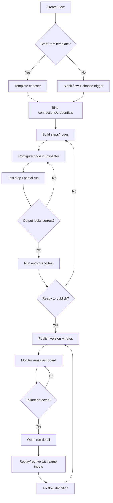
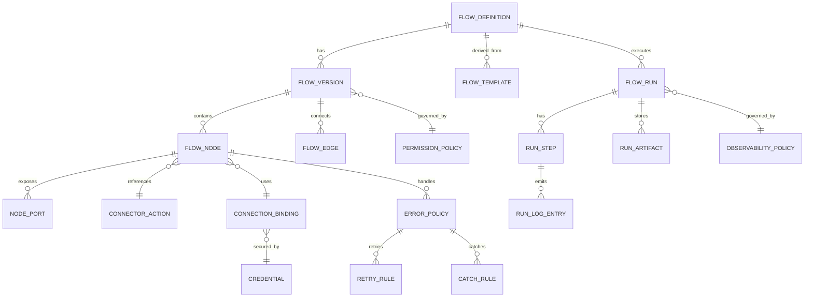

# Automation and Workflow Builder UIs: Comparative UX Research and a Clef Base Recommendation

## Executive summary

Workflow/process builders succeed when they make four things simultaneously legible: **(1) what will happen (definition), (2) what happened (execution history), (3) why it happened (data + decisions), and (4) what to do next (repair + iteration)**. Across consumer iPaaS, enterprise low‑code, cloud orchestration, and flow‑based programming tools, the most durable UX pattern is a **progressive-disclosure “builder + inspector + run history”** architecture, where simple use cases start in a guided, step-based narrative and advanced users can “open up” the same automation as a graph with deeper controls for branching, retries, concurrency, and observability. citeturn0search2turn11search5turn0search4turn1search4turn4search13turn2search2turn13search2

For Clef Base, the best base UI is a **hybrid, persona-adaptive Flow Builder** with two equivalent representations of the same underlying model:

- a **Guided “Steps” view** (ideal for novices, onboarding, and mobile; reduces graph sprawl and shortens time-to-first-success), and  
- a **Canvas “Graph” view** (ideal for complex branching, loops, parallelism, and large workflows),  
both backed by a shared **Inspector panel**, a first-class **Test/Simulate** experience, and a production-grade **Runs/Observability** suite that supports replay/redrive, retry policies, and clear error surfaces. citeturn0search2turn0search4turn1search4turn4search3turn3search2turn13search0

The most important “non-negotiable” inventory items (because they prevent the dominant failure modes) are:
- **data mapping with live, inspectable sample data** and explicit type/shape cues, not “magic strings,” citeturn0search2turn11search0turn0search4  
- **execution replay / partial rerun / redrive** with stable inputs for debugging (pin/freeze, replay, rerun), citeturn0search4turn9search3turn4search3turn13search0  
- **error handling that is designed, not improvised** (fault paths/catchers, retry/backoff, timeouts, DLQ-like “incomplete executions”), citeturn5search3turn1search1turn1search2turn3search2turn2search4  
- **versioning + environments** that match how teams actually ship automation, citeturn9search1turn4search17turn2search1  
- **permissions and observability controls that scale** (who can view inputs/outputs, log levels, retention), citeturn2search2turn4search8turn9search6  
- **accessibility alternatives to drag/drop** and keyboard-operable builder flows (critical for both compliance and platform reach). citeturn8search11turn8search0

## Research scope and methodology

This report synthesizes:
- primary/official documentation and help-center materials from mainstream workflow builders and orchestration engines (testing, mapping, branching, retries, run history, versioning, governance); citeturn0search2turn11search5turn1search4turn1search1turn1search2turn2search2turn13search2  
- academic and practitioner literature on end-user development (EUD), cognitive load, mental models, and usability inspection heuristics, to translate human factors into concrete UI requirements for automation builders; citeturn6search0turn6search5turn6search4turn10search12turn10search2  
- notable “unusual successes” where operational tooling (debugging, lineage, replay) is integrated directly into the builder rather than bolted on (a key differentiator for enterprise readiness). citeturn13search0turn4search3turn0search4turn2search2  

The Clef Base recommendation is also aligned to the provided Clef Base architectural intent: UI as a composition of views/entity pages/controls, generic form and renderer pipelines, and config-entity “builders” as first-class editing modes. fileciteturn0file1 fileciteturn0file0

## Comparative landscape and recurring design patterns

### Comparative table of major platforms and their “center of gravity”

The table below focuses on the UX *centers of gravity* (metaphor, configuration, debugging/ops), because those determine the widget inventory and the likely failure modes.

Most feature characterizations are derived from vendor docs and official help content for testing, mapping, branching, retries, run history, and observability. citeturn0search2turn11search0turn11search5turn0search4turn9search0turn1search4turn1search1turn4search3turn1search2turn4search8turn5search3turn2search1turn2search2turn13search2turn12search8

| Platform | Primary visual metaphor | Composition model | Configuration surface | Testing & debugging highlights | Ops / governance highlights |
|---|---|---|---|---|---|
| **entity["organization","Zapier","workflow automation saas"]** | Step list (“recipe”) | Linear steps + conditional branching | Per-step config + test tabs; field “pills” mapping | Step-by-step test records; mapping pills; “Paths” for branching | Auto-disable on high error ratios; troubleshooting via history; timeouts and async callbacks patterns |
| **entity["organization","Make","make.com automation platform"]** | Canvas with modules | Graph-ish, but many semantics are route-based | Module config dialogs; explicit error-handling routes | Explicit error handlers; “incomplete executions” storage + retry; router ordering rules | Scheduling controls; concurrency/queueing behaviors (sequential processing, rate limiting) |
| **entity["organization","Microsoft Power Automate","workflow automation product"]** | Vertical flow designer | Step-based with branching constructs | Step cards + configuration pane | Explicit trigger/action model; bulk cancel/resubmit runs; monitoring views for runs | Admin controls affect who can resubmit; run-history is central for operations |
| **entity["organization","n8n","open-source workflow automation"]** | Canvas node-link | Directed graph | Node detail panel; node library | Manual vs production executions; partial execution; pin/freeze data; load past execution into editor | Separate execution history vs workflow version history; retry failed executions; execution retention/pruning controls |
| **entity["organization","AWS Step Functions","aws workflow service"]** | Canvas + generated code | State machine (ASL) graph | Inspector panel (“Error handling” tab, IO filters) + code editor | Workflow Studio validates and generates definition; retries/catches/timeouts; execution details UI; redrive from failed step | Standard vs Express logging differences; execution history & log config; versions/aliases in APIs |
| **entity["organization","Google Cloud Workflows","gcp workflow service"]** | Code-first (YAML/JSON) + console pages | Structured steps with try/retry/except, loops, parallel | Editor + execution details pages | Built-in logs; call logging; debug guidance; explicit try/except and retry policies | Monitoring via Cloud Logging/Monitoring; execution backlogging and quota behaviors |
| **entity["organization","Salesforce Flow","salesforce automation builder"]** | Canvas node-link | Flow graph with elements/connectors/resources | Element properties; “resources” panel as hidden state | Fault paths for error handling; debug as another user; guidance for waits/paused interviews | Paused interview constraints (retention/limits); release improvements to debugging |
| **entity["organization","Workato","enterprise integration platform"]** | Recipe steps | Step-based with control blocks | Step configuration + formula mode | Job reports show step-level IO; rerun jobs; structured error guidance | Version creation on report customization; strong error taxonomy; monitoring tooling |
| **entity["organization","ServiceNow Workflow Studio","servicenow automation builder"]** | Workflow Studio builder | Flow + subflows + actions | Studio + “Operations” tab | Execution details from design environment; reporting levels; role-gated visibility of runtime values | Strong ops model embedded in builder; explicit performance tradeoffs for logging |
| **entity["organization","Apache NiFi","dataflow automation platform"]** | Canvas for dataflow | Flow-based programming graph | Processor config dialogs; “relationships” and auto-terminate; controller services | Data provenance/lineage; replay data from a point in flow; UI shows component state/queues | Multi-tenant authorization and access policies; operational monitoring embedded in UI |
| **entity["organization","Node-RED","flow-based programming tool"]** | Canvas flow editor | Message-passing graph | Node config dialogs; sidebar panes | Debug sidebar for live message inspection; ecosystem debugger plugin | Lightweight ops; dev-centric observability pattern (debug stream) |
| **entity["organization","Camunda Modeler","bpmn modeling tool"]** | BPMN diagram canvas | BPMN process graph | Properties panel for selected element | Strong modeling affordances via palette + properties panel | Emphasis on business–IT shared language and collaboration |

### Illustrative UI screenshots for pattern recognition

image_group{"layout":"carousel","aspect_ratio":"16:9","query":["Zapier Zap editor step builder screenshot","Make scenario builder router error handler screenshot","n8n workflow editor executions tab screenshot","AWS Step Functions Workflow Studio inspector panel screenshot","Salesforce Flow Builder debug panel screenshot","Apache NiFi UI data provenance replay screenshot"],"num_per_query":1}

### Design patterns that repeatedly win (and why)

The following patterns recur because they address the same cognitive bottlenecks: users must understand *flow control*, *data shape*, and *side effects* without reading source code.

| Pattern | Description | Where it appears | Why it works | Typical failure mode if missing |
|---|---|---|---|---|
| Builder + Inspector + Runs | Same “object” has a build surface, a detail/config surface, and execution history | Step Functions: inspector + execution details; ServiceNow: ops tab; n8n: executions + node detail | Separates “structure” from “parameters” and from “runtime truth,” reducing split attention | Users can build but cannot debug; “it failed somewhere” |
| Live sample data for mapping | Mapping UI is driven by real or representative test records and output previews | Zapier test records and field pills; n8n manual executions and pinned data | Supports recognition vs recall; enables incremental construction | Mapping becomes guesswork; type errors late |
| First-class error branches | Errors are modeled as explicit edges/paths (catch, fault path, error handler route) | Step Functions Retry/Catch; Salesforce fault paths; Make error handlers; GCP try/except | Makes “what happens on failure” part of the definition | Error handling becomes tribal knowledge; users ship brittle flows |
| Replay / redrive / rerun | Rerun with the same inputs (or from a failure point) | Step Functions redrive; NiFi replay; n8n debug with past execution | Converts debugging into a repeatable loop | “Cannot reproduce,” users resort to logging or live experiments |
| Versioning aligned to ops | Clear separation between “definition versions” and “execution instances” | n8n workflow history vs execution list; Workato job reruns vs recipe version | Prevents users from confusing “it ran” with “it was defined this way” | “I fixed it but runs still fail” confusion |
| Governance-aware observability | Runtime data visibility itself is permissioned and configurable | ServiceNow reporting levels & role-gated visibility; GCP execution history levels | Balances debugging power with privacy and performance | Either oversharing (security) or undersharing (un-debuggable) |

These patterns are directly supported by vendor docs describing testing, pinned/execution data, error paths, redrive/replay, and reporting levels. citeturn0search2turn11search0turn0search4turn9search3turn1search0turn4search3turn13search0turn5search3turn3search2turn2search2turn4search8

## Evidence from HCI and cognitive ergonomics

Automation builders are a form of **end-user programming**: users are effectively specifying a program’s control flow and data transformations, often without formal programming training. Research on end-user development emphasizes that environments must support non-programmers in creating/modifying applications and that this requires different affordances than professional IDEs. citeturn6search0turn6search3turn6search11

### Cognitive load and progressive disclosure

Workflows are high “element interactivity” tasks: correctness depends on multiple interacting elements (trigger semantics, authentication scopes, data shape, branching conditions, retries, and side effects). Cognitive load theory describes how learning/performance suffer when tasks exceed working memory capacity, motivating interfaces that reduce extraneous load and increase germane load through structured guidance, examples, and tool support. citeturn6search5turn6search12

Implications for workflow/process builders:

- **Keep “structure” and “data” simultaneously inspectable**, avoiding high split-attention. Interfaces that show node output previews in context (or in a consistent inspector) reduce extraneous load compared to forcing users to jump between multiple pages. citeturn0search4turn12search8turn2search2  
- **Prefer recognition to recall** for data mapping: provide searchable field pickers (“pills”), schema hints, and example values; the user should not need to remember field names, formats, or IDs. citeturn11search0turn11search3turn11search10turn13search3  
- **Progressively disclose advanced features** (parallelism, distributed loops, DLQ patterns, quotas): novices can succeed without touching them, but experts can reach them without leaving the builder. Step Functions’ combination of drag‑and‑drop plus inspectable generated code is an example of “graduated complexity.” citeturn1search4turn1search0  

### Mental models, signifiers, and error recovery

Good workflow UIs externalize the user’s mental model: users ask “What will happen? Where am I? What is the state?” Design literature on mental models and system feedback emphasizes that users blame themselves when systems provide weak signifiers and poor state visibility, and that closing the gulf of evaluation requires clear and interpretable system state representations. citeturn7search9turn7search7

In automation builders, the most common “mental model mismatches” are:
- **time/concurrency surprises** (parallel branches vs sequential; scheduling vs event-driven); Make’s documentation explicitly warns about route ordering and branch execution implications, illustrating how easily users mispredict time behavior. citeturn3search0turn11search5  
- **transactionality surprises** (what is rolled back vs not); both Salesforce paused interviews (new transaction on resume) and Make rollback handlers show why “side effects” must be teachable in the UI. citeturn5search2turn3search1  
- **permissions surprises** (flow runs as who? who can see inputs?); ServiceNow and Google Cloud Workflows document role/permission gating for runtime details, demonstrating a core enterprise requirement. citeturn2search2turn4search10  

### Cognitive dimensions and notation quality

The cognitive dimensions framework (and later work “beyond the notation”) focuses on how notations succeed/fail for real users: viscosity (resistance to change), hidden dependencies, premature commitment, error-proneness, and role-expressiveness are directly relevant to node-link diagrams and step lists. citeturn6search4turn6search50

Applied to workflow builders:

- **Viscosity** ⇒ refactors must be cheap: bulk move, group/subflow extraction, “convert selection to subflow,” and safe relinking are not “nice-to-haves”; they are essential for maintainability. ServiceNow’s explicit “subflows” and Workato’s “recipe functions” reflect this need for reuse and decomposition. citeturn2search3turn2search6  
- **Hidden dependencies** ⇒ show data lineage: NiFi’s provenance chain and replay illustrate a strong approach to making dependencies visible and debuggable. citeturn13search0turn13search7  
- **Premature commitment** ⇒ allow sketching: a guided “Steps” mode permits early progress while deferring decisions about data structures or error handling until the user has enough context (often after seeing a test record). citeturn0search2turn11search0turn0search4  

### Usability heuristics and evaluation discipline

Heuristic evaluation and its heuristics (originating with work by entity["people","Rolf Molich","usability researcher"] and entity["people","Jakob Nielsen","usability researcher"]) remain widely used for systematic UI review, but empirical work also cautions that heuristic evaluation can over-generate “possible issues” compared to user testing—an important reminder to validate workflow builders with real tasks. citeturn10search12turn10search2turn10search7turn10search5

For Clef Base, this suggests a practical approach:
- apply heuristics early to catch predictable breakdowns (state visibility, consistency, error recovery), then  
- run usability tests on representative automation tasks to calibrate the builder’s real bottlenecks (mapping, debugging, governance).

## Recommended Clef Base UI architecture and interaction flows

Clef Base already frames “builders” as editing modes of config entities (views, workflows), and frames UI as emergent composition from View / Entity Page / Control primitives. The Flow Builder should treat automations and workflows similarly: **automations are config entities with dedicated form modes** (guided builder + graph builder) and first-class execution entities for ops. fileciteturn0file1 fileciteturn0file0

### Recommendation: a unified “Flow Builder” with two synchronized representations

**Core decision:** implement a single underlying Flow model and provide two UI representations:
1. **Steps view** (linear narrative with expandable branches/loops)  
2. **Graph view** (node-link canvas)

Users can toggle views without losing information; the UI should never force a rewrite to switch metaphors.

Why this is the best “base UI”:
- Step-based UIs reduce onboarding friction and support fast “happy path” composition and templating. citeturn0search2turn11search3  
- Canvas UIs scale better for advanced control flow and visibility of structure. citeturn1search4turn13search2  
- Dual-mode supports novice→expert progression (a known requirement in end-user development environments). citeturn6search0  

### Base layout mockup: three-pane builder + persistent run tools

A pragmatic layout that matches dominant successful patterns:

**Top bar (global)**
- Flow name, environment (Draft/Published), version badge
- Run/Test controls (Run, Run with sample, Debug from last run)
- Save, Publish, Share, … menu

**Left rail (library + navigation)**
- Node palette (Connectors/actions)
- Templates
- Subflows/components
- Data types / schemas (optional)
- Search across nodes and docs

**Center (primary surface)**
- Steps view *or* Graph view canvas
- Minimaps and breadcrumbs for deep nesting (subflows, scopes)

**Right (Inspector)**
- Config panel for selected step/node (forms, validations)
- Data mapping & expression editor
- Error handling / retry policy editor for the step
- Permissions / run-as / connection binding

**Bottom / secondary**
- Collapsible “Run drawer” with last execution summary, logs, and step outputs

This mirrors the “builder + inspector + run detail” architectures seen in Step Functions Workflow Studio (inspector + code + run results), ServiceNow Workflow Studio (ops tab embedded), and n8n (executions + node details). citeturn1search4turn2search2turn0search4turn9search0

### Interaction flow: author → test → publish → observe → debug → iterate

Key UX commitments in this flow are supported by documented “test step,” “partial execution,” and “redrive/retry” mechanisms across leading systems. citeturn0search2turn0search4turn9search3turn4search3turn3search2

### Entity relationship model: what must exist in the platform to support the UX

To make debugging, versioning, permissions, and observability first-class, the UI must be backed by explicit entities (whether implemented as concepts, schemas, or both).

This model is consistent with common platform distinctions:
- definitions vs executions, citeturn9search1turn9search0turn4search13  
- credential bindings and role-gated runtime visibility, citeturn2search2turn4search10  
- retry/catch policies, citeturn1search1turn1search2  
- and replay/redrive semantics. citeturn4search3turn13search0  

## Widget and component inventory for Clef Base

This inventory is organized as a **prioritized backlog** and specifies each component’s **purpose, key props, states, and example interactions**. “Props” are intentionally UI-framework-agnostic; they map cleanly to Clef concepts/widgets and Surface resolution.

### Priority scheme

- **P0 (MVP-critical):** without this, users cannot reliably build, test, and operate flows.  
- **P1 (V1 enterprise-ready):** governance, collaboration, scaling, higher-order abstractions.  
- **P2 (V2 differentiation):** marketplace depth, AI assistance, advanced analytics, power tooling.

### Builder shell and navigation

**AppShell + FlowBuilder shell (P0)**  
Purpose: consistent navigation, identity, and global actions; supports View/Entity Page/Control composition. fileciteturn0file1  
Key props: `currentUser`, `workspace`, `navItems`, `breadcrumbs`, `globalSearchProvider`, `notificationsProvider`.  
States: normal, loading, offline/degraded, permission-denied.  
Interactions: search (Ctrl/Cmd+K), switch workspace/environment, open notifications.

**Template chooser (P0)**  
Purpose: fast start; reduce blank-canvas cost for novices.  
Key props: `templates[]` (with tags, complexity, connectors), `filters`, `previewRenderer`, `installAction`.  
States: empty, loading, filtered-empty, install-failed.  
Interactions: preview template → “Use template” → bind connections → land in builder pre-wired.

**Node/step palette (P0)**  
Purpose: discovery of triggers, actions, logic blocks, subflows, and utilities.  
Key props: `categories`, `searchIndex`, `recentlyUsed`, `compatibleOnly` toggle (contextual filtering by current step/port), `docLinks`.  
States: expanded, collapsed, searching, offline (limited).  
Interactions: drag onto canvas; click “Add step”; keyboard select; “favorite” an action.

### Modeling surface: Steps view and Graph view

**Steps view renderer (P0)**  
Purpose: linear narrative with nested branches; mobile-friendly; onboarding.  
Key props: `flowVersion`, `expandedScopes`, `validationSummary`, `selection`.  
States: normal, validation-error, diff-highlight (when comparing versions).  
Interactions: insert step between steps; collapse/expand branch; convert block to subflow; reorder within scope.

**Graph canvas (P0)**  
Purpose: scalable control-flow visualization and editing.  
Key props: `nodes`, `edges`, `layoutMode` (manual/auto), `zoom`, `pan`, `snapGrid`, `readonly`.  
States: idle, dragging, connecting, multi-select, invalid-connection, autolayout-running, performance-degraded (LOD).  
Interactions: drag nodes; connect ports; multi-select and align; context menu; zoom to fit; mini-map navigation.

**Node card (P0)**  
Purpose: represent a unit of computation/action.  
Key props: `id`, `title`, `icon`, `type` (trigger/action/condition/loop/parallel/delay/subflow/transform/code), `statusBadge` (valid/invalid), `ports[]`, `annotations`.  
States: default, hover, selected, focused (keyboard), disabled, invalid, running/has-last-run-status.  
Interactions: select to open Inspector; inline rename; quick add outgoing connection.

**Edge/connector (P0)**  
Purpose: represent control/data paths.  
Key props: `fromPort`, `toPort`, `label` (condition name, error type), `style` (normal/error).  
States: normal, hover, selected, invalid.  
Interactions: relink endpoint; label edit; “convert to switch/branch” assistant.

**Scope/group/subflow container (P1)**  
Purpose: reduce viscosity and “spaghetti”; encapsulate. citeturn2search3turn2search6  
Key props: `childNodes`, `inputs`, `outputs`, `collapsed`, `color`, `name`.  
States: collapsed/expanded, readonly, diff-view.  
Interactions: create from selection; drill into subflow; publish subflow as reusable component.

### Inspector and configuration panels

**Inspector panel container (P0)**  
Purpose: single, consistent place for configuration, validation, mapping, policies.  
Key props: `selectedEntity`, `tabs[]` (Config/Data/Error/Permissions/Docs), `saveState`.  
States: clean, dirty, saving, save-failed, readonly.  
Interactions: switch tabs; jump-to-field from validation errors.

**Connector binding widget (P0)**  
Purpose: bind node to a connector integration + credential.  
Key props: `connector`, `availableConnections[]`, `createConnectionAction`, `permissionInfo`.  
States: unbound, bound, credential-invalid, permission-denied.  
Interactions: “Connect account” flow; re-auth; test connection.

**Field mapper (P0)**  
Purpose: map outputs → inputs with clear typing and previews (“pills”). citeturn11search0turn11search3turn0search4  
Key props: `inputSchema`, `availableFields` (from prior nodes), `typeCoercions`, `defaultValues`, `validationRules`.  
States: empty, mapped, partially-mapped, type-mismatch, required-missing.  
Interactions: click “+” to insert field; drag pill; open preview; auto-map suggestions.

**Expression editor (P0)**  
Purpose: computed mappings and conditions; must be safe and explainable.  
Key props: `language` (simple/advanced), `functions`, `autocomplete`, `typeHints`, `lintRules`, `evalPreview`.  
States: valid, invalid-syntax, runtime-error (preview), warning (implicit cast).  
Interactions: inline evaluation against sample record; insert reference by click; show type at cursor.

**Schema/shape viewer (P0)**  
Purpose: reduce “mystery JSON”; show typed tree/table views.  
Key props: `data`, `schema`, `viewMode` (tree/table/raw), `diffMode`.  
States: large-data-collapsed, truncated-with-warning, redacted.  
Interactions: expand node; copy JSON path; “pin this field.”

**Validation and lint summary (P0)**  
Purpose: prevent publish of invalid flows; guide error recovery.  
Key props: `issues[]` (severity, location, quickFix), `blockPublishRules`.  
States: none, warning-only, error-blocking.  
Interactions: click issue → focus node/field; apply quick fix; suppress (with rationale) for warnings.

### Workflow components: what users can build

A “complete” builder needs a coherent set of component types that cover the mainstream control-flow and integration needs documented across platforms.

**Triggers (P0)**  
Support: manual trigger, schedule trigger, event/webhook trigger, record/data-change trigger. citeturn0search3turn1search7turn0search5turn5search6  
UI: trigger node with special start affordance; trigger test panel; schedule editor.

**Actions/tasks (P0)**  
Support: API action, create/update/read operations, message/email, file operations, etc.  
UI: action node with operation picker; input mapping; test button.

**Conditionals/branches (P0)**  
Support: if/else, multi-outcome switch/decision; branch labels. citeturn11search5turn5search9turn1search1  
UI: decision node; per-branch condition editor; default path; branch ordering hints.

**Loops / iterations (P0)**  
Support: for-each over list, while/until; map-style iteration; batch sizing and limits. citeturn5search0turn2search6turn1search1turn4search8  
UI: loop container with body scope; “current item” variable display; iteration preview in debug.

**Parallelism (P1)**  
Support: parallel branches, join semantics; concurrency limits. citeturn1search1turn4search8  
UI: parallel block; join configuration; warnings about downstream ordering assumptions.

**Wait/delay and long-running orchestration (P1)**  
Support: delay until time/event, pause/resume with state persistence; (human approval optional). citeturn5search2turn4search8  
UI: wait node with resume conditions; state persistence explanation; limits surfaced (size/time).

**Error policies (P0)**  
Support: per-node retry/backoff/timeout; catch to fallback; global error handler; “break and store incomplete execution”; optional rollback semantics when supported. citeturn1search0turn1search2turn3search2turn3search1turn5search3turn2search4  
UI: Error tab in inspector; visual error edges; policy templates (“retry transient,” “fail fast,” “compensate”).

**Data transformations (P0)**  
Support: format/parse, map fields, filter list, merge, dedupe, JSON transform, schema cast.  
UI: transform node; mapping table; previews; type coercion warnings. (Patterns are heavily implied by mapping and error docs for type mismatch/format errors.) citeturn11search10turn2search0turn13search3  

**Custom code/action (P1)**  
Support: code node with sandbox, libraries, secrets boundaries; execution logs.  
UI: code editor, lint, unit tests for function, sample IO.

**Subflows / reusable functions (P1)**  
Support: define inputs/outputs, version them, call from flows. citeturn2search3turn2search6turn4search8  
UI: create subflow wizard; signature editor; publish; usage search.

### Testing, simulation, debugging, and observability

**Run/Test toolbar (P0)**  
Purpose: tight build→test loop.  
Key props: `canRun`, `runModes` (test/manual/partial), `lastRunStatus`.  
States: running, queued, blocked-by-validation.  
Interactions: run full; run from here; cancel run; open last run.

**Step test / sample record capture (P0)**  
Purpose: capture representative inputs and outputs. citeturn0search2turn11search0turn0search4  
Key props: `testRecord`, `refreshAction`, `editableSample` toggle, `storeSampleAction`.  
States: none, loading, captured, stale, permission-redacted.  
Interactions: “find new records”; choose sample; reuse sample downstream.

**Pin/freeze data (P1)**  
Purpose: iterative building without re-triggering expensive APIs. citeturn0search4  
Key props: `pinnedNodes[]`, `pinnedData`, `editPinnedAllowed`.  
States: pinned, pinned-stale, pinned-disabled-in-prod.  
Interactions: pin node output; edit pinned; run downstream only.

**Partial execution / run-one-step (P1)**  
Purpose: accelerate debugging of deep flows. citeturn0search4  
Key props: `targetNode`, `requiredUpstreamNodes`.  
Interactions: execute step; bypass disabled nodes; show inferred dependencies.

**Runs list / executions dashboard (P0)**  
Purpose: production truth: success/fail/wait, filter, search, quick actions. citeturn9search2turn4search10turn2search1turn4search17  
Key props: `filters` (status, time, flow, version), `bulkActions` (retry/resubmit/cancel), `retentionInfo`.  
States: loading, empty, permission-limited.  
Interactions: filter; bulk retry/resubmit; export.

**Run detail timeline + step IO viewer (P0)**  
Purpose: explain why failures occur, where data changed. citeturn2search2turn9search7turn4search13turn13search7  
Key props: `run`, `steps[]` with IO, `logEntries`, `redactionPolicy`.  
States: live-follow, completed, failed, waiting.  
Interactions: click step → show input/output; highlight path on canvas; compare retries.

**Replay/redrive/rerun controls (P1)**  
Purpose: operational recovery and reproducible debugging. citeturn4search3turn13search0turn9search0turn2search1  
Key props: `rerunMode` (same version vs current version), `startFromStep`, `preserveSuccessfulSteps`.  
Interactions: redrive from failed; rerun with latest definition; clone run into test.

**Logging controls + retention (P1)**  
Purpose: balance observability with cost/privacy/performance. citeturn2search2turn4search8turn9search6turn4search0turn4search6  
Key props: `logLevel`, `historyLevel`, `retentionPolicy`, `maskingPolicy`.  
Interactions: increase logging for test runs; restrict runtime value visibility; prune old runs.

**Alerting and analytics dashboard (P2)**  
Purpose: health monitoring (SLO-like) and product value measurement.  
Key props: `metrics` (success rate, latency, retries), `alertRules`, `channels`.  
Interactions: create alert from run failure; subscribe; view per-connector error rates.

### Governance, collaboration, and platform requirements

**RBAC + permissions editor (P0/P1)**  
Purpose: enterprise readiness: who can edit, run, view IO, manage credentials. citeturn2search2turn4search10turn9search4  
Key props: roles, policies, scopes (definition vs runs vs secrets).  
Interactions: grant role; restrict “view inputs”; allow resubmission only for own runs.

**Versioning UI (P1)**  
Purpose: safe change management; compare, restore, release notes. citeturn9search1turn2search1turn4search17  
Key props: `versions[]`, `diffRenderer`, `publishNotes`, `restoreAction`.  
Interactions: compare versions side-by-side; restore; clone as new.

**Collaboration: comments, mentions, presence (P2)**  
Purpose: teams ship automation collaboratively (esp. in enterprise).  
Key props: `presence`, `comments`, `lockingStrategy`.  
Interactions: comment on node; mention user; resolve thread.

**Internationalization (i18n) + locale tooling (P1)**  
Purpose: translations for UI strings and for templates/tools; locale-specific date/number handling in mappings. (Locale-sensitive formatting issues are common in date/time mapping errors.) citeturn11search10turn13search3  

**Accessibility widgets (P0)**  
Purpose: keyboard operability + assisted drag alternatives. WCAG 2.2 explicitly requires alternatives to dragging for functionality and improved focus visibility. citeturn8search0turn8search11  
Required components: keyboard focus ring, “move node via arrows,” list-based reorder alternatives, accessible modals, target size. citeturn8search11turn8search0  

**Marketplace / installable connectors & templates (P2)**  
Purpose: scale ecosystem; reduce time-to-value. Evidence: n8n nodes/community nodes + templates; Zapier templates; Make templates. citeturn0search6turn9search5turn11search13turn3search0  
Key props: `packages[]`, `trustSignals` (verified, perms), `installFlow`, `updateFlow`.  
Interactions: install; review permissions; upgrade with changelog.

## Failure modes and mitigations, with implementation roadmap

### Common complaints and failure modes (evidence-grounded)

The complaints below recur because they are structural. Many are explicitly documented as “common errors,” platform constraints, or UX pain points in vendor materials.

**Unhelpful, vague runtime errors (“something failed”)**  
Salesforce training materials call out the “unhandled fault” experience as confusing to users and emphasize using fault paths and fault messages to improve outcomes. citeturn5search3  
Mitigation: enforce “error path required” for risky nodes (writes, external calls), provide default error message UX, and include “next action” suggestions (fix permissions, required fields, validation rules). citeturn5search3turn2search0  

**Silent data-shape mismatch in mapping**  
Zapier and Workato docs describe field format/type problems and missing required fields that can pass design-time but fail at runtime. citeturn11search10turn2search0  
Mitigation: schema-aware mapping with type hints, inline coercion previews, lint rules (“might be null”), and sample-based validation. citeturn11search0turn0search4turn13search3  

**Concurrency and ordering surprises**  
Make warns that routes are processed sequentially and highlights how branch order affects downstream timing, while Zapier notes surprising behaviors when branches or delay steps interact. citeturn3search0turn11search5  
Mitigation: explicit concurrency semantics displayed in the UI (parallel vs sequential badges), “timing analyzer” in tests, and deterministic execution model documentation linked from inspector.

**Long-running orchestration edge cases (wait/resume, state size, transactions)**  
Salesforce documents constraints for paused interviews (resume behaviors, size limits, batching), and Step Functions/Workflows describe timeouts, retries, and long-running execution behaviors. citeturn5search2turn1search1turn4search8turn4search14  
Mitigation: state inspection UI, explicit persistence model, guardrails (max payload size warnings), and “resume simulation” that shows which state is persisted.

**Operational debugging without replay**  
Systems that support replay/redrive reduce mean time to recovery: Step Functions redrive continues from failed step with same input; NiFi can replay data from points in the flow; n8n can load past execution data into the editor for debugging. citeturn4search3turn13search0turn9search3  
Mitigation: design replay as a first-class control, not a hidden admin feature.

**Over-logging vs under-logging tensions**  
ServiceNow documents performance impact of higher reporting levels and role constraints for seeing runtime values; Google Cloud Workflows exposes execution history levels and call logging options; Step Functions differentiates execution history availability and logging between workflow types. citeturn2search2turn4search8turn4search6turn4search13  
Mitigation: observability policy object: (a) how much to log, (b) who can see it, (c) retention policy, (d) what gets redacted, with UI defaults tuned to safe operation.

### Mitigation strategies mapped to UI requirements

- “Design-time + runtime co-design”: builder must always have a “Where will I see this when it runs?” pointer to runs UI and logs. citeturn2search2turn4search10turn9search0  
- “Error handling as a primitive”: provide visualized error edges and composable error policies (retry/catch/compensate/break-store). citeturn1search0turn3search2turn5search3  
- “Replayable executions”: treat execution artifacts as durable entities with (optional) retention and redaction. citeturn9search6turn4search8turn13search0  

### Implementation considerations and phased roadmap

This section assumes no specific tech stack constraints; the focus is on complexity drivers and risk.

#### MVP (P0) — “Build, test, run, and see what happened”

Deliverables:
- Steps view builder (trigger → actions → basic conditionals) with inspector configuration. citeturn0search3turn11search0  
- Graph view (basic node-link) if feasible; otherwise defer and make Steps view excellent first.  
- Field mapping with sample records + schema hints. citeturn0search2turn11search0turn0search4  
- Run list + run detail with step IO and errors. citeturn9search2turn2search2  
- Basic error policies: timeout, retry (simple), “catch to stop with message.” citeturn1search0turn1search2turn5search3  
- Accessibility baseline: keyboard navigation and non-drag alternatives for core operations. citeturn8search11turn8search0  

Complexity/risk:
- **Medium engineering risk** in consistent data-shape modeling and mapping UX (requires strong schema abstraction).  
- **High UX risk** if run history and error messages are weak: users will churn because they cannot debug. citeturn5search3turn2search0  

#### V1 (P1) — “Enterprise-ready reliability and change management”

Deliverables:
- Robust branching/switch, loops, and parallel blocks; explicit concurrency semantics. citeturn5search0turn1search1turn4search8  
- Replay/redrive and “debug from execution” loop. citeturn4search3turn9search3turn13search0  
- Versioning/restore/diff and environments (draft vs published). citeturn9search1turn2search1turn4search17  
- Observability policy: log levels, retention, redaction, and permission gating. citeturn2search2turn4search8turn9search6  
- Credential management UX with re-auth flows and “run as” semantics. citeturn2search2turn5search12  

Complexity/risk:
- **High product risk** if versioning semantics are confusing; must clearly separate definition versions from run instances. citeturn9search1turn9search0turn4search13  
- **High security/privacy risk** without IO redaction and runtime visibility controls. citeturn2search2turn4search2  

#### V2 (P2) — “Scale, ecosystem, and differentiation”

Deliverables:
- Marketplace for templates/connectors; verified packages and permission review. citeturn11search13turn0search6turn9search5  
- Advanced analytics (success rates by connector, MTTR, cost attribution), configurable alerts. citeturn4search2turn2search4  
- AI-assisted authoring that respects governance (generate flow draft + explainable diffs), but treated as an accelerator not a substitute for observability. (The caution comes from longstanding EUD findings: users still need transparency and control.) citeturn6search0turn10search7  
- Deep provenance/lineage style debugging for data-heavy workflows (NiFi-like trace/replay). citeturn13search7turn13search0  

Complexity/risk:
- **Medium engineering risk** in package safety and upgrade workflows; **high support risk** if marketplace introduces incompatible versions without clear dependency signaling.

### Final recommendation for Clef Base

Implement a **Flow Builder** as a first-class config-entity editor with:
- **dual representation (Steps + Graph)**,  
- a consistent **Inspector** for configuration, data mapping, and error policies,  
- and a production-grade **Runs** experience with replay/redrive and governance-aware observability.

This recommendation is the most robust synthesis of:
- step-based onboarding strengths (fast adoption, templating, guided mapping), citeturn0search2turn11search3  
- graph-based scalability for complex control flow, citeturn1search4turn13search2  
- and the operational tooling required to prevent the dominant failure modes (un-debuggable flows, brittle error handling, and “mystery data”). citeturn5search3turn13search0turn4search3turn2search2turn0search4  

It also matches Clef Base’s expressed architectural direction: UIs as composable primitives and builders as formal config editing modes, rather than ad-hoc screens. fileciteturn0file1