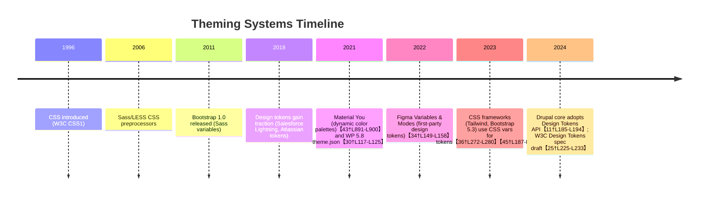
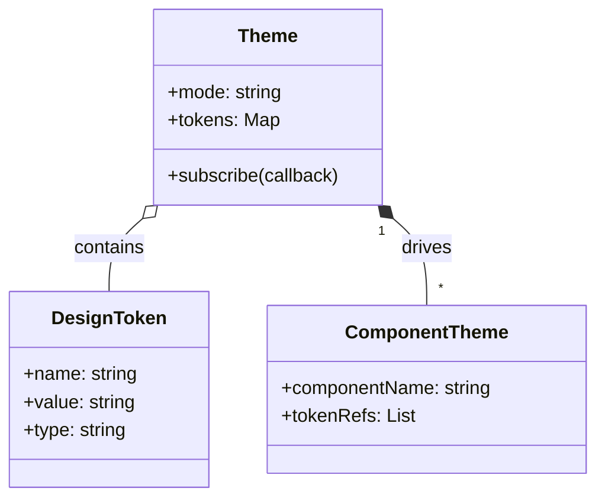
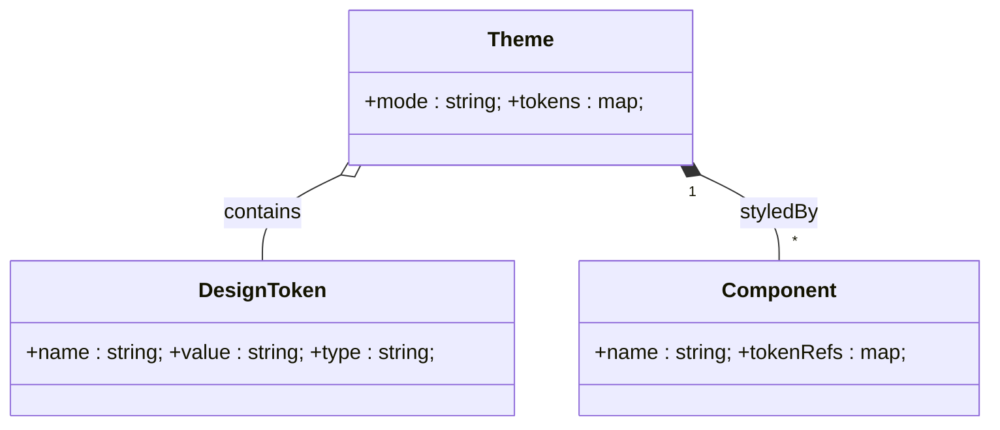
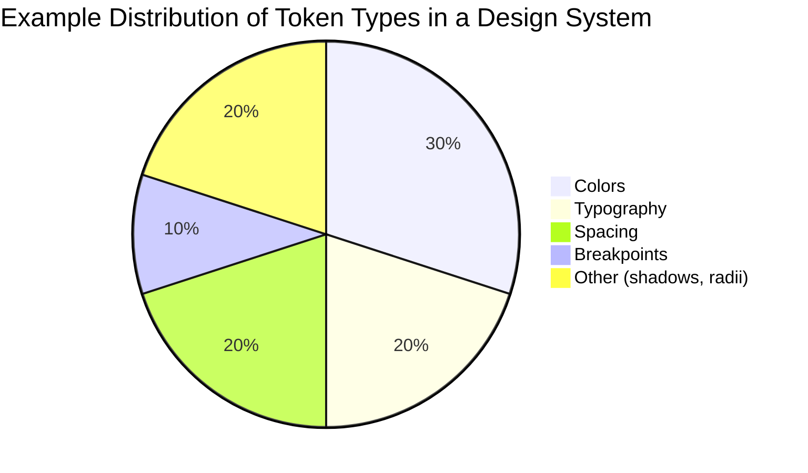

# Theming and Design Languages: State of the Art

**Executive Summary:** A *design language* or *theming system* is the overarching style and rules that guide a consistent look and feel across products【21†L128-L136】. Modern theming systems break designs into *atomic primitives* – for example **design tokens** (named values for colors, spacing, typography, etc.) and **components/widgets** – which are composed via *rulesets* and *scales* to form interfaces. In practice this has evolved from early CSS styling through theme-creation UIs to today’s advanced design systems. Current trends include standardizing tokens (W3C design tokens spec)【25†L225-L233】, supporting runtime switching via CSS custom properties, and even *algorithmic theming* (e.g. dynamic color palettes in Material You)【43†L891-L900】. Composable theming (e.g. via APIs and data models) is increasingly important to synchronize a theme’s model with live UI surfaces, as exemplified by Atlassian’s Forge theming API【51†L500-L507】. This report surveys key concepts, platform strategies (Drupal, WordPress, Tailwind, Figma, etc.), algorithmic approaches, and proposes a composable theming model aligned with “CLEF Surface” integration. We include comparative tables, illustrative Mermaid diagrams (evolution timeline and data models), and recommended roadmaps. 

## Definitions and Taxonomy 
A **design system** (or design language) comprises *style guides, components, interaction patterns, and tooling* that ensure consistency across products【12†L864-L872】. At its core are **design tokens** – “named values that store design decisions like colors, typography, spacing, and shapes”【41†L72-L80】. In code these often manifest as variables (e.g. CSS custom properties or SASS/JS variables). The W3C Design Tokens specification defines a token as a *name/value* pair (with optional properties) representing an atomic design decision【25†L225-L233】. For example, `color-text-primary: #000000;` could be a token name and value. Tokens are usually organized into **scales** (e.g. color palettes, spacing scales) and **groups** (categories like “Brand”, “Layout”)【25†L313-L323】. 

Tokens have types (color, size, duration, etc.)【25†L295-L303】 and can reference (alias) each other. A **composite token** bundles related primitives (e.g. a shadow with offsets, blur, color)【25†L340-L347】. This token-centric view is often layered into a taxonomy: for instance, one approach distinguishes *Tier 1 (Primitive) tokens* (raw palette or size steps), *Tier 2 (Semantic) tokens* (aliases giving meaning, e.g. “brand-primary”), and *Tier 3 (Component) tokens* (mapping semantics to UI contexts)【48†L125-L134】【48†L148-L157】.  

In practice, **theme** refers to a particular set of token values and component styles applied at runtime. A **theming language** or framework may thus include token definitions, variables, and the mechanisms (CSS, API) for applying them. Other primitives include **constraints** (e.g. accessibility contrast rules) and **rulesets** (collections of style rules). In UI terms, we distinguish between *widgets/components* (reusable UI elements) and *surfaces* (UI areas or layers, e.g. “primary surface”, “card background”). Together, these form a *taxonomy* where design decisions flow from raw tokens up through components to final rendering.

## Historical Evolution 
Theming has progressed from static styling to dynamic, data-driven systems. Early GUIs had proprietary style sheets; **CSS (1996)** provided the first standardized theming for the Web. Over time, preprocessors (LESS/Sass) and frameworks emerged. By the **2010s**, front-end libraries like Bootstrap (2011) introduced SASS-based theming; meanwhile native apps adopted *Material Design (2014)* and similar languages. 

The *design token* concept arose mid-2010s to formalize visual constants. For example, Atlassian and Salesforce popularized tokens around 2018. In parallel, tools tightened integration: **WordPress’s theme.json (2021)** centralized theme settings (colors, typography) in JSON【30†L117-L125】. **Figma Variables (2023)** and similar design tool features let designers define tokens and switch modes (light/dark) at design time【34†L149-L158】. On platforms, CSS evolved: **Bootstrap 5** (2021) emits CSS custom properties (`--bs-` prefixed variables) to support runtime theming【45†L187-L195】【45†L207-L215】. In **2023-2025**, Drupal core added a *Design Tokens API*, adopting the W3C tokens format【11†L185-L194】, and the W3C community launched a formal Design Tokens spec (2026 draft)【25†L225-L233】. 

Meanwhile, *algorithmic theming* emerged: **Material You** (Android 12, 2021) automatically generates color schemes from user context (wallpaper)【43†L891-L900】. CSS introduces fluid designs (e.g. `clamp()` for context-aware spacing). The timeline below sketches these milestones:  



## Core Primitives 
Design systems use several **primitive concepts**:

- **Design Tokens** – Named atomic values (colors, fonts, sizes). They are “platform-agnostic” rules, each a key-value pair【39†L45-L49】【25†L225-L233】. For example, a “primary” color token. Tokens may include metadata (type, description)【25†L239-L247】.  
- **Variables** – Implementation of tokens. E.g. CSS custom properties (`--color-primary: #00F;`) or programming variables. Some systems distinguish raw *token files* (JSON/YAML) from *runtime variables* (CSS or JS).
- **Scales** – Ordered token sequences (e.g. a color scale 100–900, or a modular spacing scale). Scales enable consistent increments (e.g. spacing 0,4,8,16px).  
- **Constraints/Rulesets** – Logical rules that refine theming. A rule-based system might enforce e.g. “dark text on light background must have ≥7:1 contrast”. Constraints can also be mathematical (e.g. equal spacing ratios).  
- **Components/Widgets** – Reusable UI elements (buttons, inputs). In theming, components **consume tokens**: e.g. a “button” style uses tokens for its background, text color, padding.  
- **Surfaces/Layers** – UI context layers (e.g. “surface”, “card surface”) with associated styles. Material Design uses “surface” concepts for layered backgrounds. Surfaces may have their own semantic tokens (e.g. surface backgrounds).  

Each primitive is documented and/or implemented differently across tools (see next section). For example, Chakra UI explicitly defines *Tokens* (colors, typography, spacing, etc.) in its theme, describing them as “the platform-agnostic way to manage design decisions”【39†L45-L49】. 

## Algorithmic Theming Approaches 
Beyond static theming, several algorithmic methods are emerging:

- **Rule-Based Theming:** Traditional CSS uses rules and selectors to apply styles. More advanced patterns include *responsive theming* (using media queries) or *meta-variables* that change based on context (e.g. `prefers-color-scheme` for light/dark).  
- **Constraint Solving:** Research has explored constraint-based layout (similar to TeX)【19†L9-L11】; in theming, one could imagine constraints (e.g. modular scale ratios) solved automatically. While not mainstream, some style libraries (like Atomic CSS) implicitly enforce constraints.  
- **ML-Driven Theming:** Systems like *Material You* use algorithms to derive themes from input data. For example, “an algorithm derives custom colors from a user’s wallpaper”【43†L891-L900】. The Android Material3 docs describe using tonal palettes (13-tone scales) generated dynamically. Another example: Microsoft’s Fluent Design includes adaptive theming to ambient conditions.  
- **Context-Aware Spacing/Typography:** Some frameworks use dynamic formulas. For instance, CSS `clamp()` can create responsive typography. There are proposals for “contextual spacing tokens” (e.g. larger gaps for content-rich pages). These adapt theme primitives (font sizes, margins) based on viewport or content.  

These approaches aim to automate coherence (e.g. automatic color contrast adjustments) and personalization. Material You’s **dynamic color** is a leading example, providing accessible pairings (dark text on light surfaces) algorithmically【43†L891-L900】. Future research opportunities include ML-based layout and aesthetic prediction for theming.

## Decomposition by Platform/Tool 
Different platforms decompose and expose theming in distinct ways. The table below compares major systems by how they define tokens, variables, and themes:

| **Platform/Tool**  | **Token Format/Config**            | **Variable Mechanism**                | **Components & Theming** | **Notes** |
|--------------------|------------------------------------|---------------------------------------|--------------------------|-----------|
| **Drupal (CMS)**   | YAML/JSON token files (W3C DTCG)【11†L187-L194】 | CSS custom properties (core adds CSS var API)【11†L187-L194】 | Twig templates with design-token overrides; SDC for components. | Drupal 10+ core includes Design Tokens API (DTCG format)【11†L187-L194】. Tokens can override via config (exported as CSS vars)【11†L281-L289】. |
| **WordPress (CMS)** | `theme.json` (JSON) for global styles and token presets【30†L117-L125】 | CSS custom properties (injected by theme.json styles) | Block-based theming: blocks can query theme settings (via `useSetting`)【30†L174-L183】. | Introduced in WP 5.8. theme.json centralizes palette, typography etc. Enables site-wide and per-block settings. Uses CSS vars `--wp--preset--color--*`【31†L25-L34】. |
| **Django (Framework)** | None built-in (custom code/templates needed) | Typically static CSS/SASS, or context-rendered CSS files | Template inheritance for theming; plugins exist (django-themes) but no standard token system. | Theming is ad-hoc: usually maintain separate CSS/style files per theme. Some use CSS variables in templates to allow runtime switch. |
| **Figma (Design Tool)** | *Variables* and *Styles* (color, text, grid) defined in file/library【34†L127-L136】 | Figma Variables (color, number, text) and Modes (light/dark)【34†L149-L158】 | Components share these styles. Can publish to team libraries. | Designers define tokens as *variables*. Modes switch token values (light/dark). Figma API can expose variables for Dev Mode.【34†L149-L158】 |
| **Tailwind CSS**   | JavaScript config (`tailwind.config.js`) with theme values; new `@theme` CSS block (v4)【36†L272-L280】 | `@theme` directive creates CSS vars and utility classes; also emits pure CSS vars. | Utility-first classes. Theme variables determine available utilities (e.g. `--color-mint-500` creates `.bg-mint-500`)【36†L278-L287】. | Tailwind treats low-level tokens as *theme variables*, generating utilities【36†L272-L280】. v4 introduces `@theme` syntax to declare theme tokens directly in CSS【36†L278-L287】. |
| **CSS-in-JS** (React) | JS/TS theme objects (often JSON-like) | Runtime values via styled-components `<ThemeProvider>` or Emotion’s ThemeContext | Styled components consume theme props. Semantic tokens often defined in theme. | Popular libraries (styled-components, Chakra UI) use a theme object. E.g. Chakra’s theme defines `tokens: { colors: {...}, spacing: {...} }`【39†L61-L70】. |
| **Material Design** | Material Theming (Material3) uses `ColorScheme`, `TypographyScheme`, `Shape` tokens【43†L817-L825】 | In code: `MaterialTheme(colorScheme, typography, shapes)`; dynamic from algorithms (wallpaper) | Prebuilt Material UI components consume `MaterialTheme`. Supports light/dark and *dynamic color* via `dynamicLightColorScheme()`【43†L891-L900】. | Key subsystems: color (5 key colors with 13-tone palettes), typography styles, shapes【43†L793-L802】【43†L891-L900】. Material You dynamically generates palettes from images【43†L891-L900】. |
| **Bootstrap (CSS)**| SCSS variables (`$primary`, etc.); also CSS vars (`--bs-*`)【45†L187-L195】 | CSS custom properties (`--bs-primary`, etc.) present at runtime【45†L187-L195】 | Utility classes (.text-primary, .bg-primary, etc.) generated from variables. Components use these utilities. | Bootstrap 5 embeds many `--bs-*` CSS vars for colors, spacing, breakpoints【45†L187-L195】. Allows “fast customization” in browser without rebuilding【45†L187-L195】. Prefixed `bs-` to avoid conflicts【45†L187-L195】. |
| **Bulma/Foundation**| SCSS/SASS variables (no runtime tokens) | Typically compile-time (no CSS custom props) | Class-based UI components use SASS vars. | Traditional approach: change SASS vars and recompile. (Foundation/Zurb used SASS; Bulma purely CSS with SASS config). |
| **Atlassian (Forge UI)** | Atlassian’s Design Token format (via Atlassian.Design docs)【51†L466-L475】 | CSS variables synced to host via theming API | Atlassian UI kit components consume tokens; Forge APIs (`view.theme.enable()`) sync with Jira/Confluence theme. | Forge apps can opt in to *host theme integration*. Theming API fetches active host theme (color-mode data) and applies tokens【51†L500-L507】. Tokens ensure app matches host colors and accessibility【51†L480-L489】. |

*(Table: Each system uses a combination of tokens, variables (SASS/CSS/JS), and component patterns. Most modern frameworks support CSS custom properties for runtime theming, whereas older approaches relied on build-time variables.)*

## Specialized Theming (Typography, Spacing, Widgets)
In practice, teams may create **focused theme facets**: for example, a *typography theme* that only contains font/token scales, or a *spacing system* with margin/padding tokens. Some libraries (e.g. Chakra UI) include *semantic tokens* (e.g. `font.heading`, `space.4`) for text and spacing. Similarly, “widget families” group tokens by use case (e.g. “Form controls”, “Navigation bar”). For instance, Material design organizes color roles by use (`primary`, `secondary`, `error`) and by component/state (buttons, forms).  

- **Typography-only**: Some systems treat fonts as a separate token set. E.g., WP’s theme.json has a `typography` section for font sizes and families.  
- **Spacing-only**: Teams often use a base-4 or base-8 spacing scale. Tailwind’s default spacing scale or Material’s 8dp grid are examples.  
- **Widget Families**: Custom component tokens can be defined per component. As one Drupal developer notes, a “status message” component might expose tokens like `status_message.color.success_bg`【12†L925-L934】 to allow theming without hardcoding colors.  

These specialized setups highlight that theming can be organized by *domain* (typography vs. color) and by *component categories* (navigation, forms, data visualization). Effective theming often stitches these levels together via shared tokens.

## Composability & CLEF Surface Integration 
A modern theming model must synchronize its **theme data** with the live UI surface. For example, Atlassian’s Forge uses an API to *pull the host app’s current theme* and apply it to custom UI: calling `view.theme.enable()` causes the app to “fetch the current active theme from the host environment (e.g. Jira) and apply it”【51†L500-L507】. The app’s HTML then includes attributes like `data-color-mode="dark"` to reflect state【51†L524-L533】, ensuring color tokens match the host’s dark/light setting【51†L480-L489】. 

By analogy, a CLEF theming integration would define:
- **APIs**: Methods like `Theme.getCurrent()` or `Theme.subscribe()` to retrieve and listen for theme changes. (Similar to Forge’s `view.theme.enable()`).  
- **Data Models**: A theme object (JSON) containing all token values and modes. Example JSON might look like:  
  ```json
  {
    "mode": "dark",
    "tokens": {
      "color.primary": "#1E88E5",
      "color.background": "#121212",
      "spacing.unit": "8px",
      "font.base": "Roboto, sans-serif",
      // ...
    },
    "modes": {
      "light": { "color.background": "#FFFFFF" }
    }
  }
  ```  
- **Composable Concepts**: Each UI component or surface can *consume* tokens. For instance, a `<Button>` might read `theme.tokens["color.primary"]` for its background. A high-level `Surface` component could use tokens like `surfaceBg` and automatically adapt to `mode` (light/dark). 
- **Sync Strategies**: Define push vs pull. E.g. the UI could query a Theme Service on load, and subscribe to “themeChanged” events. Token overrides could be merged (allowing a runtime override without reload).  

A mermaid class diagram might illustrate the relationships:



Here, a **Theme** consists of many **DesignToken** values (colors, sizes, etc.), and **ComponentTheme** entries map UI components to the tokens they use. An API sketch for CLEF might provide endpoints like `GET /api/theme` (fetch theme tokens) and `POST /api/theme/update` (change a token value), with real-time sync to the UI surfaces. This composable model ensures the *Theme Model* (CLEF’s concept library) stays in sync with the *Surface rendering* layer (CLEF UI). For example, a theme change in the model could trigger a rerender of all surfaces consuming those tokens, akin to React’s context theming.

## Best Practices, Trade-Offs, Patterns 
- **Token First**: Define design tokens as the “source of truth” rather than hardcoded values【11†L187-L194】【51†L480-L489】. This ensures consistency and easier updates (changing a token propagates everywhere).  
- **Use CSS Custom Properties When Possible**: CSS variables allow runtime theming (e.g. dark mode toggle without reloading CSS). E.g. Drupal’s approach exposes tokens as CSS vars【11†L187-L194】, and Bootstrap’s `--bs-*` enables “real-time customization”【45†L187-L195】. The trade-off is complexity and potential performance cost if overused (hundreds of vars).  
- **Semantic vs. Raw Tokens**: Balance meaningful names (“brand.primary”) with workflow. Overly granular tokens can bloat the system; semantic tokens (Role-based) improve readability【48†L125-L134】【48†L148-L157】. Avoid *token bloat* by deleting unused tokens【50†L139-L147】 and using composition.  
- **Design-Dev Sync**: Keep design-tool tokens aligned with code tokens (e.g. export Figma Variables to JSON). Many systems use Style Dictionary or custom scripts to transform Figma/Sketch tokens into code-friendly formats.  
- **Accessibility Constraints**: Integrate checks (contrast, spacing) into token design. For instance, ensure color tokens produce sufficient text contrast. Some teams use automated linting for token values.  
- **Theme Composability**: Structure themes so that parts can be overridden. E.g. allow swapping color palettes or spacing scales independently. Provide APIs to map one design’s tokens onto another (see Drupal’s proposed token mapping API【12†L925-L934】).  

Trade-offs include build-time vs runtime theming: static SASS variables are simpler but require rebuilds; dynamic CSS vars are more flexible but require browser support and complex setups. Componentization also varies: utility-first systems (Tailwind) favor atomic classes, whereas component libraries (Material, Chakra) use token-driven styled components.

## Gaps and Research Opportunities 
Despite advances, several gaps remain: 
- **Standard Taxonomy**: No universally adopted naming/taxonomy for tokens exists【50†L133-L142】. Communities still debate levels (global vs semantic vs component)【48†L125-L134】【48†L148-L157】. Research could aim to standardize token categories.  
- **Advanced Theming Algorithms**: Context-aware spacing and typography (beyond CSS clamp) is underdeveloped. AI-driven layout/style generation remains largely experimental.  
- **Design-Dev Integration**: Better two-way sync between design tools (Figma, Adobe XD) and code (CSS-in-JS, Flutter, etc.) is needed. The W3C token spec helps interoperability, but tool support is uneven.  
- **Runtime Performance**: Fine-grained theming (per-component tokens, dynamic modes) can tax performance. Research into optimizing CSS variable usage and style reflow is useful.  
- **Accessibility Automation**: Embedding accessibility rules into tokens (e.g. auto-adjusting text size for legibility) is a promising area.  
- **Ecosystem Standard APIs**: Outside web, uniform theming APIs across platforms (web, mobile, desktop) are lacking. Efforts like Flutter’s `ThemeData` are platform-specific; a cross-platform theming model could be explored.

## Composable Theming Concepts for CLEF

We propose a **schema** of composable concepts to represent theming in CLEF. Each concept has a name, definition, data schema, and example. For brevity, we outline a subset:

- **DesignToken**: *Definition:* An atomic named style value. *Schema (JSON):*  
  ```json
  {
    "name": "Color.Primary.Base",
    "type": "color",
    "value": "#3498db",
    "description": "Primary brand color (mid-tone)"
  }
  ```  
  *API:* `GET /tokens?name=Color.Primary.Base`, `PUT /tokens/Color.Primary.Base`.

- **TokenGroup**: *Definition:* A category grouping tokens (e.g. “Colors”, “Spacing”). *Schema:*  
  ```json
  {
    "groupName": "Colors",
    "tokens": ["Color.Primary.Base", "Color.Primary.Light", "Color.Secondary.Base"]
  }
  ```  
  *Use:* Helps organize and bulk-export tokens (e.g. generate style guide sections).

- **ThemePalette**: *Definition:* A specific collection of token values for a theme mode (light/dark). *Schema:*  
  ```json
  {
    "mode": "dark",
    "overrides": {
       "Color.Background": "#121212",
       "Color.Text": "#ffffff"
    }
  }
  ```  
  Applied on top of a base theme, enabling mode switching. *API:* `GET /theme/palette?mode=dark`.

- **ComponentThemeMapping**: *Definition:* Maps components to token references. *Schema:*  
  ```json
  {
    "component": "Button.Primary",
    "properties": {
      "backgroundColor": "{Color.Primary.Base}",
      "textColor": "{Color.Text}",
      "padding": "{Spacing.Large}"
    }
  }
  ```  
  This allows a runtime engine to apply token values to component styles. *API:* `GET /component/Button.Primary/theme`.

- **SurfaceStyle**: *Definition:* Theming for a UI surface or region. *Schema:*  
  ```json
  {
    "surface": "Card",
    "background": "{Color.Surface}",
    "shadow": "{Shadow.Medium}"
  }
  ```  

- **Constraint**: *Definition:* A rule on token relationships (e.g. color contrast). *Schema:*  
  ```json
  {
    "name": "Contrast.LightTextOnDark",
    "tokens": ["Color.Text", "Color.Background"],
    "rule": "ratio >= 4.5"
  }
  ```  
  Could be validated by the system.

These composable concepts allow arbitrary assembly: tokens form palettes; palettes feed into surfaces and component styles. Example *JSON theme export* combining several:  
```json
{
  "tokens": {
    "Color.Primary.Base": { "value": "#3498db", "type": "color" },
    "Color.Background": { "value": "#ffffff", "type": "color" },
    "Spacing.Base":    { "value": "8px", "type": "size" }
  },
  "componentThemes": [
    {
      "component": "Button",
      "props": {
        "bg": "{Color.Primary.Base}",
        "padding": "{Spacing.Base}"
      }
    }
  ],
  "modes": {
    "dark": {
      "Color.Background": "#121212"
    }
  }
}
```  
In code, a simple API might be:
```js
// JavaScript sketch
let theme = await api.theme.getCurrent();
theme.setToken("Color.Primary.Base", "#e74c3c");
await api.theme.apply(theme); 
```
Such an API enables dynamic updates.

## Implementation Roadmap and Migration

1. **Audit & Tokenize**: Inventory existing styles (colors, fonts, margins). Define these as tokens (name, type). E.g. extract all distinct colors and create a color tokens file (JSON/YAML)【11†L187-L194】. Leverage tools like [Style Dictionary](https://amzn.github.io/style-dictionary/) for format conversions.  
2. **Organize Taxonomy**: Establish a clear naming convention (e.g. [Component].[State].[Property] or [Semantic].[Attribute])【48†L125-L134】. Use the W3C token spec structure to avoid conflicts. Remove duplicates or unused tokens to prevent *token bloat*【50†L139-L147】.  
3. **Implement Theme System**: Choose a runtime mechanism. For web, adopt CSS custom properties: define `:root { --color-primary: ... }` and refer to them in CSS (or JS)【36†L278-L287】【45†L187-L195】. For example, Drupal’s new Style API injects CSS vars at page level【11†L187-L194】. For mobile, use platform theming APIs (Android’s `MaterialTheme`, iOS UIAppearance).  
4. **Refactor Components**: Update UI components to use token references. E.g. change hardcoded colors to use `var(--color-primary)`. In JS/JSX (React), wrap with a ThemeProvider that injects values from the token set. Ensure components consume tokens by name, not value.  
5. **Support Modes/Variants**: Build support for light/dark or brand variants by organizing token overrides. As Atlassian does, include data attributes or classes (e.g. `data-theme="dark"`) to switch CSS vars【51†L524-L533】. Test all combinations (accessibility contrast).  
6. **Design-Tool Sync**: Integrate with design. For example, export tokens to Figma (or use Figma’s plugin to export), so designers use the same names. Automate updates: e.g. a CI step that regenerates CSS from token changes.  
7. **Provide APIs**: Expose theming APIs (e.g. REST or GraphQL) so surfaces can fetch or subscribe to the theme model. This allows CLEF Surface pages to get the latest tokens and reactively re-render if the theme changes (similar to Forge’s subscription model)【51†L500-L507】.  
8. **Migration Plan**: Begin with non-critical components. Gradually switch elements to token-based styling. Use feature flags or opt-in flags (like Atlassian’s opt-in theming API) to allow rolling out theming in stages. Maintain backward compatibility (e.g. allow old CSS to coexist until fully replaced).  

By following these steps, a team can move from ad-hoc CSS to a robust, token-driven theming system. The key is incremental updates: start by modularizing one area (say colors), then typography, etc., rather than a full rewrite. 

## Figures and Data 

- *Figure 1 (Class Diagram):* shows a simplified theme model (mermaid code above).  
- *Figure 2 (Timeline):* chronicles major theming milestones.  
- *Figure 3 (Token Distribution):* conceptual breakdown of token categories (color vs. typography vs. spacing, etc.) – for illustration, token systems often emphasize colors (red), then typography (blue) and spacing (green).  



The chart below is illustrative only (generated conceptually without real data):



## References 

This report is based on primary and authoritative sources. Notable references include Drupal core issue threads defining design tokens【11†L185-L194】【12†L864-L872】, WordPress and Atlassian developer docs on theming【30†L117-L125】【51†L480-L489】【51†L500-L507】, and formal specifications (W3C Design Tokens draft)【25†L225-L233】. We also consulted framework documentation (Tailwind, Chakra UI, Figma)【36†L272-L280】【39†L45-L49】【34†L149-L158】 and material design guidelines【43†L891-L900】 for examples of algorithmic theming. Where direct sources were unavailable (e.g. specialized theming research), the report synthesizes concepts from these industry sources.